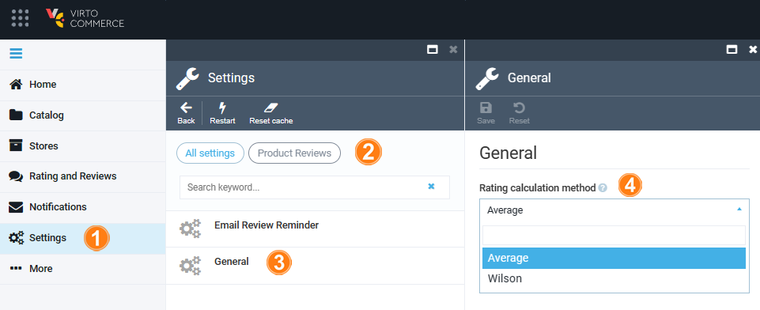

# Settings

The **Rating and reviews** module settings include:

* [Email review reminder](managing-reviews.md#enable-email-review-reminder).
* [General settings](settings.md#general-settings).

## General settings

To configure general settings:

1. Click **Settings** in the main menu.
1. Type **Review** to find the settings related to the module.
1. Select **General**.
1. In the next blade, select **Average** or **Wilson** calculation method from the dropdown list.

    

1. Click **Save** in the top tollbar to save the changes.

The settings have been saved.
