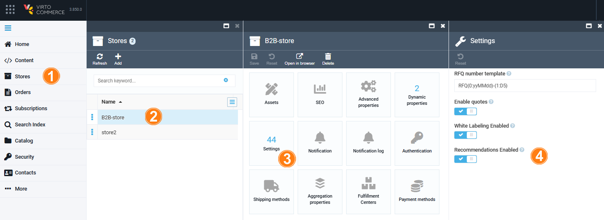

# Enable Recommendations

To enable recommendations display via the Store module:

1. Click **Stores** in the main menu.
1. In the next blade, select the desired store.
1. In the next blade, click on the **Settings** widget.
1. In the next blade, switch **Recommendations Enabled** to on.

    

The recommendations are displayed in the Frontend Application.

!!! note
    You can enable the recommendations display via the [Recommendations module settings](settings.md).