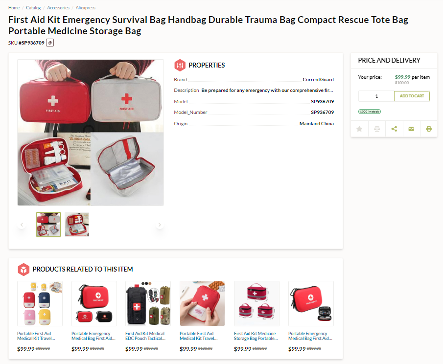
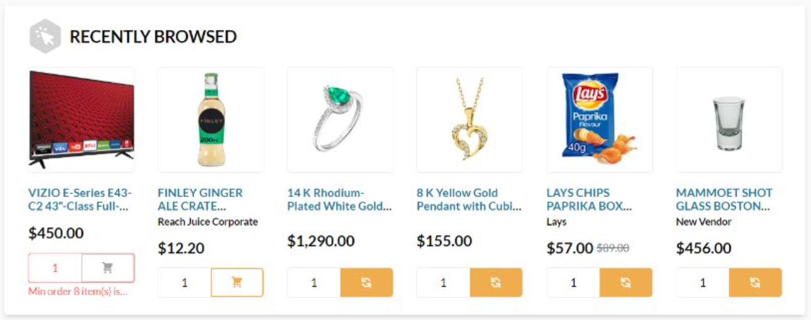
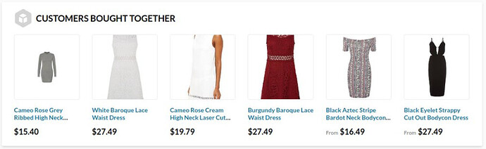
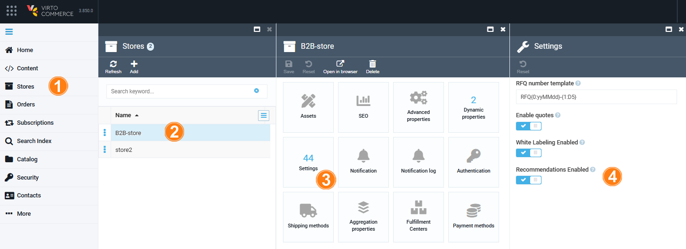

# Overview

The xRecommend module displays recommendations to the current product. These recommendations help users expand their search and explore more broadly by suggesting similar or complementary items. This allows users to discover alternatives even if they don’t find an exact match:

In the cart, it also shows recently browsed products:

{: width="750"}

In the product page after **Products related to this item** block, you can also display items that other customers frequently bought together with those the current user is purchasing:

Although the xRecommend module does not have its own user interface, you need to have it installed to manage recommendations. 

## Prerequisites

* [xApi module](https://github.com/VirtoCommerce/vc-module-x-api) module version 3.800 or higher.
* [xCatalog module](https://github.com/VirtoCommerce/vc-module-x-catalog) module version 3.800 or higher.
* [ElasticSearch8 module](https://github.com/VirtoCommerce/vc-module-elastic-search-8) module module version 3.805 or higher.
* [Semantic Search and ELSER model](https://github.com/VirtoCommerce/vc-module-elastic-search-8?tab=readme-ov-file#semantic-search-and-elser-model-setup) should be set up for Elastic Search 8 module.

## Key features

* **Semantic Similarity**: Machine learning-based product recommendations using Elastic Search.
* **Customizability**: Adjustable parameters, including the number of recommendations.
* **Extensibility**: Support for extending the **related-products model** or adding custom algorithms.
* **Integration Simplicity**: Toggle setting for enabling or disabling recommendations in your store.

## Get started

To enable recommendations display:

1. Click **Stores** in the main menu.
1. In the next blade, select the desired store.
1. In the next blade, click on the **Settings** widget.
1. In the next blade, switch **Recommendations Enabled** to on.

    

The recommendations are displayed in the Frontend Application.
