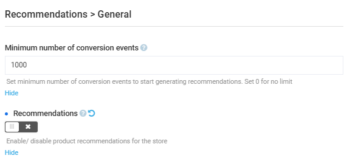

# Settings

To open the settings of the Recommendations module:

1. Click **Settings** in the main menu.
1. In the search field of the next blade, type **Recommendations** to find the settings related to the module.
1. Click **Recommendations** to open the available settings.
1. Click **General** to configure the following settings:
    * **Minimum number of conversion events**: Defines the minimum number of conversion events (such as purchases, add-to-cart actions, or other tracked customer behaviors) required before the Recommendations module starts generating personalized product recommendations. Enter 0 to disable the limit. Recommendations will start immediately but may lack precision due to insufficient data.
    * **Recommendations enabled**: Enables the recommendations display in the Frontend Application:

        {: style="display: block; margin: 0 auto;" }

1. Click **Save** in the toolbar to save the changes.

The settings have been configured.

 
 
********

    <a href="../enable-recommendations">← Enabling recommendations</a>
    <a href="../../return/overview">Return module overview →</a>

