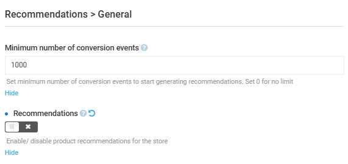

# Settings

To open the Recommendations module settings:

1. Open **Stores** from the main menu.
1. In the next blade, select  your store.
1. In the next blade, click on the **Settings** widget.
1. Find **Recommendations** settings in the left panel and click **General**.
1. In the next blade, configure the following:

    {: style="display: block; margin: 0 auto;" }

1. Click **OK**, then **Save** in the toolbar to save the changes.

Your modifications have been applied.

 
 
********

    <a href="../enable-recommendations">← Enabling recommendations</a>
    <a href="../../return/overview">Return module overview →</a>

