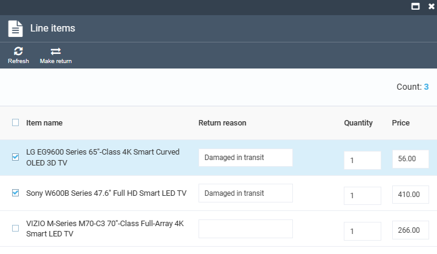
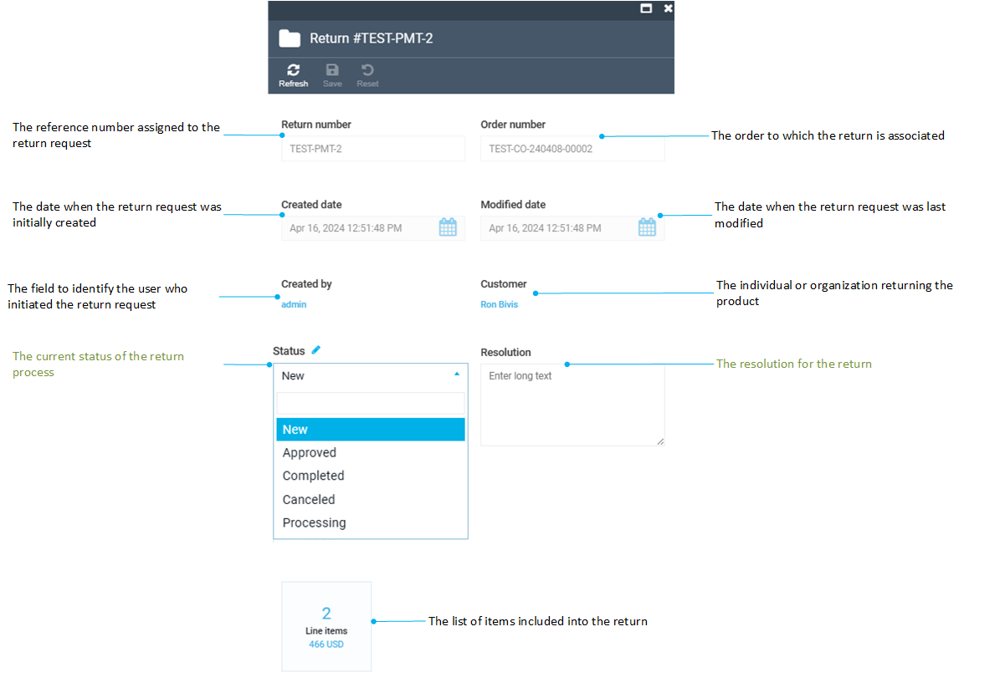

# Manage Returns

Managing returns includes:

* [Creating returns via the Return module.](managing-returns.md#create-return-via-return-module)
* [Viewing and processing returns via the Return module.](managing-returns.md#processing-returns)
* [Creating returns via the Orders module.](../order-management/managing-returns.md#create-return)
* [Viewing and processing returns via the Orders module.](../order-management/managing-returns.md#viewing-and-processing-returns)

## Create return via Return module

To create a return via the Return module:

1. Click **Return** in the main menu.
1. The next blade displays the list of existing returns. Click **Add new return** in the toolbar. 
1. The next blade displays the list of created customer orders. Click on the order for which you need to create a return. 
1. The next blade displays the list of items in this order:
    * Check the items to return.
    * Specify the return reason.
    * If required, correct the amount and the price of the items returned.

    

1. Click **Make return** in the toolbar. 
1. In the **Return** blade, edit the fields with the description typed in green:

    

1. Click **Save** in the toolbar to save the changes. 

The created return appears in the **Return list** blade.

{: width="25"} [Creating Returns via the Orders Module](../order-management/managing-returns.md#create-return)

## Processing returns

To process the created return:

1. Click **Return** in the main menu.
1. In the next blade, select the required return from the list. 
1. In the next blade, edit the return status and/or the resolution. See step 4 from the instruction above. 

    !!! note
        You cannot delete line items or returns as a whole.

1. If required, click on the **Line items** widget to edit the return reason.
1. Click **Save** in the toolbar to save the changes.

Your changes have been saved.

{: width="25"} [Creating Refund Documents](../order-management/managing-documents.md#create-refund-documents)