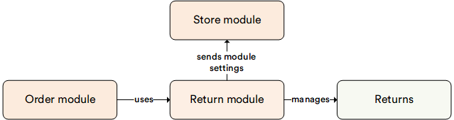

# Return

The **Return** module gives you an opportunity to view and manage all return operations. Once a customer returns an item to your store, this information appears in the list of returns.

!!! note
    This module requires preinstalled **Order** and **Store** modules.

## Key Features

With the Return module, you can:

* Create and view the returns.
* Edit return statuses.
* Filter returns and search for the required return using keywords. 

The diagram below illustrates the interconnections among various key entities within the Return module:

