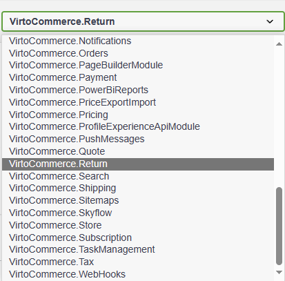

# REST API

Access the [REST API endpoint](https://virtostart-demo-admin.govirto.com/docs/index.html) and select **VirtoCommerce.Return** from the dropdown list.



Below are some examples of using REST API functionality to:

* [Query returns.](rest-api.md#query-returns)
* [Query available quantities.](rest-api.md#query-available-quantities)

## Query returns

To query detailed information about each return request:

1. Select **POST /api/return/search** from the menu.
1. Fill in the request body as follows: 

    ```json
    {
      "orderId": "<some_guid>",
      "objectIds": [
        "<some_guid>"
      ],
      "keyword": "<some_keyword>",
      "sort": "Ascending",
      "skip": 0,
      "take": 0
    }
    ```

1. Click **Execute** to receive the following response:

    ```json
    {
    "totalCount": 21,
    "results": [
        {
        "number": "RET220314-00001",
        "orderId": "e3ede9031a61421b924bda2fbadf6aef",
        "status": "Approved",
        "resolution": "Some resolution",
        "order": {
            //customer order fields
        },
        "lineItems": [
            {
            "returnId": "2fffc88f-014a-48a0-b80d-29a178a43b29",
            "orderLineItemId": "4c893e7fe56348b5a05c8b4671c5f140",
            "quantity": 9,
            "availableQuantity": 0,
            "price": 589.99,
            "reason": "Not wanted",
            "createdDate": "2022-03-14T07:17:08.074618Z",
            "modifiedDate": "2022-03-15T11:47:47.6054095Z",
            "createdBy": "admin",
            "modifiedBy": "admin",
            "id": "1caa064b-d199-4671-beba-126ece340d86"
            },
            {
            "returnId": "2fffc88f-014a-48a0-b80d-29a178a43b29",
            "orderLineItemId": "c32a0b78aac84cb8becf6657fe9895fa",
            "quantity": 7,
            "availableQuantity": 0,
            "price": 399,
            "reason": "Not needed",
            "createdDate": "2022-03-14T07:17:08.0818378Z",
            "modifiedDate": "2022-03-15T11:47:16.6209129Z",
            "createdBy": "admin",
            "modifiedBy": "admin",
            "id": "3504cd3f-d7b9-4b7c-8ab0-6c7aa2d47025"
            }
        ],
        "createdDate": "2022-03-14T07:17:08.0586692Z",
        "modifiedDate": "2022-03-29T13:55:46.5941812Z",
        "createdBy": "admin",
        "modifiedBy": "admin",
        "id": "2fffc88f-014a-48a0-b80d-29a178a43b29"
        }
    ]
    }
    ```

## Query available quantities

To query data detailing the available quantities for returnable items associated with that particular order:

1. Select **GET /api/return/available-quantities/{orderId}** from the menu.
1. In our example, let's request available quantities for returnable items associated with the order **e3ede9031a61421b924bda2fbadf6aef**: `GET /api/return/available-quantities/e3ede9031a61421b924bda2fbadf6aef`
1. Click **Execute** to receive the following response:
    
    ```json
    {
      "4c893e7fe56348b5a05c8b4671c5f140": 3,
      "c32a0b78aac84cb8becf6657fe9895fa": 21
    }
    ```
