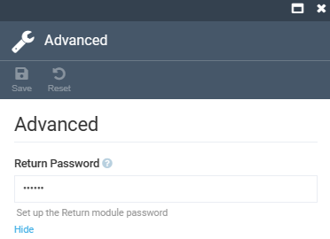
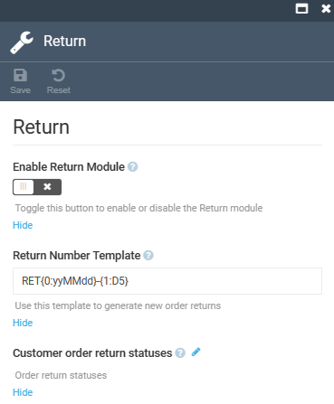
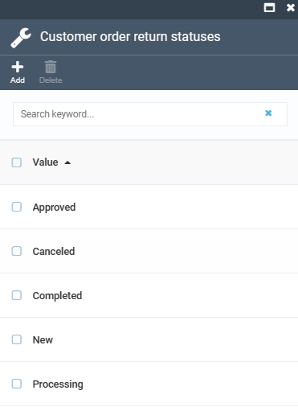

# Settings

To configure the **Return** module settings:

1. Click **Settings** in the main menu.
1. In the search field of the next blade, type **Return** to find the settings related to the module.
1. Click **Advanced** to set up the return module password:

    

1. Click **Return** to configure the following settings.

    

    1. Click  to add or delete order return statuses

        

1. Click **Save** in the toolbar to save the changes.

The settings have been saved.

 
 
********

    <a href="../managing-returns">← Managing returns</a>
    <a href="../../search/overview">Search module overview →</a>

