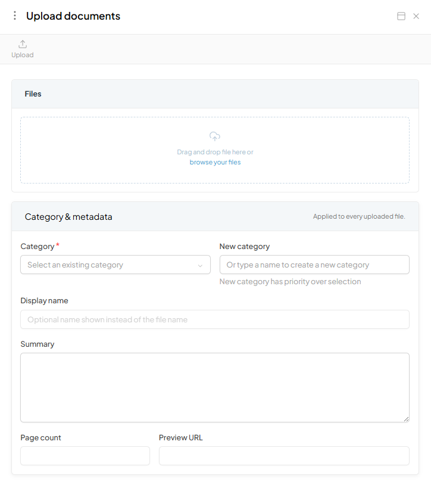

# Document Library

The **Document Library** menu item lets administrators upload sales materials for reps to use. Only reps with the **Advanced sales representative** role can browse, open, and download these documents on the Frontend.

To upload a document:

1. Click **Document Library** in the main menu.
1. In the next blade, click **Upload** in the toolbar.
1. In the next blade, upload your file (the supported file types are JPEG, PNG, ZIP, PDF, WEBP, XLS, TXT, and DOC) and fill in the following fields:

    {: style="display: block; margin: 0 auto;" width="600"}

1. Click **Upload** in the toolbar.

The document is now available to advanced sales representatives on the Frontend.

{: width="20"} [Document library on the Frontend](/storefront/user-guide/latest/account/sales-rep-hub#document-library)

 
 
********

    <a href="../managing-sales-reps">← Managing sales reps</a>
    <a href="../../search/overview">Search module overview →</a>

