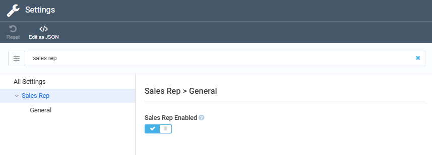

# Enable Sales Rep App

The app itself is global, but you can enable or disable the feature for each store:

1. Click **Stores** in the main menu.
1. In the next blade, select the required store.
1. In the next blade, select the **Settings** widget.
1. In the search field of the next blade, type **Sales rep** to find the module-related settings.
1. Turn the **Sales rep enabled** feature to on.

    {: style="display: block; margin: 0 auto;" }

1. Click **OK**, then **Save** in the previous blade.

The Sales Rep application has been enabled for your store.

 
 
********

    <a href="../overview">← Overview</a>
    <a href="../managing-sales-reps">Managing sales reps →</a>

 