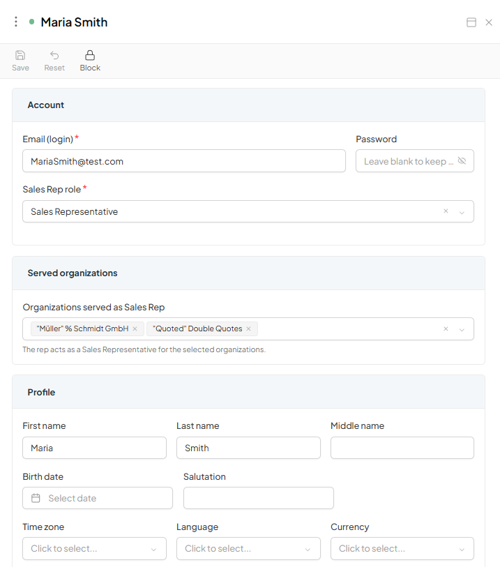
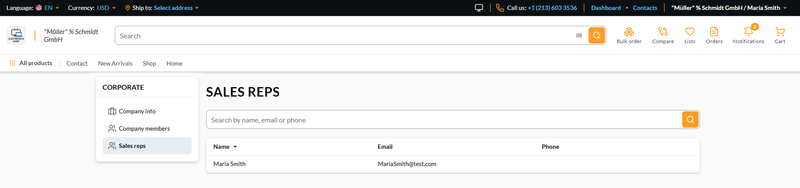

# Manage Sales Reps

From the Sales Rep App, you can:

* View every Sales Rep and how many organizations each one serves.
* [Add](#add-sales-rep) or [edit](#edit-sales-rep) a sales rep and choose which organization(s) they serve.
* [Block, unblock](#block-or-unblock), or [delete](#delete-sales-rep) a rep's account.

## Add sales rep

To add a new sales rep:

1. Click **Sales Reps** from the main menu.
1. In the next blade, select **Sales Reps** and click **Add** in the toolbar.
1. Fill in the following fields:

    {: style="display: block; margin: 0 auto;" }

1. Click **Save** in the toolbar.

Your new sales rep has been added to the list.

On the Frontend, you can see a new sales rep added to the sales rep list of the specified organization:

!!! note
    The role you select here is applied both as the rep's global account role and as the role on every membership for the organizations you select. Changing it later re-points every assignment at once, including memberships that previously granted access through a different role.

## Edit sales rep

To edit sales rep data:

1. Click **Sales Reps** from the main menu.
1. In the next blade, select **Sales Reps** and select the sales rep to edit.
1. In the next blade, modify the information.
1. Click **Save** in the toolbar.

Your modifications have been applied.

## Block or unblock

To block or unblock a sales rep:

1. Click **Sales Reps** from the main menu.
1. In the next blade, select **Sales Reps** and select the sales rep.
1. In the next blade, click **Block** or **Unblock** in the toolbar.
1. Click **Save** in the toolbar.

The user has been blocked or unblocked.

## Delete sales rep

To delete a sales rep:

1. Click **Sales Reps** from the main menu.
1. In the next blade, select **Sales Reps** and check the sales rep to delete.
1. Click **Delete** in the toolbar.
1. Confirm your action.

The account has been deleted.

!!! note
    Deleting a Sales Rep removes both the Contact member and its login account (and all roles/memberships). There is no way to keep one without the other. This cannot be undone.

 
 
********

    <a href="../enabling-sales-rep">← Enabling Sales Rep App</a>
    <a href="../../search/overview">Search module overview →</a>

