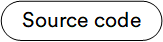
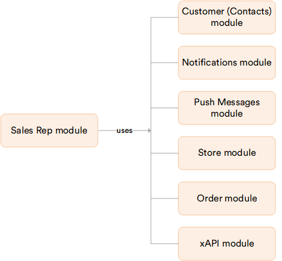

# Overview

The **Sales Rep** module turns selected users into sales representatives who serve a defined set of customer organizations. It provides a back-office application for administrators to create, assign, and manage reps.

## Key features

With the Sales Rep module, you can:

* **Manage sales representatives**: Create, edit, block, unblock, and delete reps.
* **Assign customers to a rep**: Give a rep the customer organizations they serve through a per-organization role. A global role marks a user as a rep without tying them to any specific customer.
* **Manage the rep's login account**: Set the store, password, and lockout.
* **Reuse existing data**: Model a rep from a contact, a login account, and a role, with no new data structures.
* **Show reps to buyers**: Let buyers see the sales reps supporting their organization.
* **Show customers to reps**: Let reps see the customers they serve, each with the rep's latest order for that customer.
* **Show a customer card**: Display the organization, primary contact, and account type.
* **List and filter orders**: Show the orders a rep created for their customers.
* **Contact a customer**: Send a push notification or an email to the members of a customer organization.
* **Toggle the Frontend UI**: Enable or disable the Frontend Sales Rep UI per store.

The diagram below illustrates the dependencies of the Sales Rep module:

{: style="display: block; margin: 0 auto;" }

 
 
********

    <a href="../../return/overview">← Return module overview</a>
    <a href="../enabling-sales-rep">Enabling Sales Reps App→</a>

