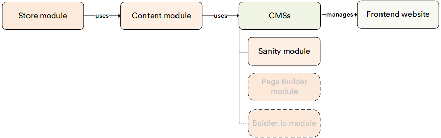

# Overview

The **Sanity** module integrates [Sanity](https://www.sanity.io/), a powerful headless CMS, with the Virto Commerce platform. It allows your marketing and content teams to create, manage, and publish rich ecommerce content in Sanity Studio, while automatically syncing that content to your Virto Commerce Frontend. Unlike the Content module, which manages pages and assets directly within the Virto Commerce platform, the Sanity module connects to an external, best-in-class content authoring environment and delivers its content through Virto Commerce.

The [Content module](../content/overview.md) must be installed before using the Sanity module, as it provides the underlying content storage and delivery infrastructure.

## Key features

The diagram below illustrates the relationships within the Virto Commerce Content Management System:

{: style="display: block; margin: 0 auto;" }

With the Sanity module, you can:

* Author and manage ecommerce content (landing pages, banners, editorial articles, etc.) directly in Sanity Studio.
* Publish content changes that automatically propagate to your Virto Commerce Frontend without developer involvement.
* Combine Sanity-managed content with Virto Commerce product and catalog data for rich, content-driven shopping experiences.
* Deliver consistent content across web, mobile, and other digital touchpoints from a single source.

{: width="25"} [Sanity module setup](/platform/developer-guide/latest/Extensibility/cms-integrations/sanity-setup)

 
 
********

    <a href="../../pages/overview">← Pages module overview</a>
    <a href="../../ai-doc-processing/overview">AI Smart Capture module overview →</a>

