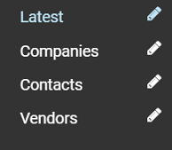

# Search Options

When dealing with numerous records, you will require searching and filtering options to efficiently locate the specific items you're looking for. Virto Commerce provides two searching options:

* [Keyword search.](search.md#keyword-search)
* [Filtering.](search.md#filtering)

## Keyword search

The most straightforward approach to locating an item is by utilizing the keyword search. Simply enter a keyword or a portion thereof into the keyword search bar, and the results you require will be generated:

{: style="display: block; margin: 0 auto;" width="400"}

To enable broader and more powerful search capabilities across indexed fields, our search supports **OR** and **AND** search expressions. 

=== "**OR** expression"

    The **brand:FABORY OR fastener_finish:"Zinc Plated"** query returns the following:

    {: style="display: block; margin: 0 auto;" }

=== "**AND** expression"

    The **brand:FABORY AND fastener_finish:"Zinc Plated"** query returns the following:

    {: style="display: block; margin: 0 auto;" }

To enable broader and more powerful search capabilities across indexed fields, our search supports [various search expressions](search-query-syntax.md). 

## Filtering

=== "Using default filters"

    To use default filters, open the dropdown list:

    {: style="display: block; margin: 0 auto;" }

=== "Adding new filter"

    Click {: width="25" height="23"} to create your own custom filters. These new filters can be based on record content, creation dates, etc. To configure a filter, provide a search phrase. The user interface offers reference guidance on utilizing different search phrases:

    (contacts/media/filters.png){: style="display: block; margin: 0 auto;" }

    In the example above, the filter is set to show all records created between November, 9 and November 11, 2022.

    Once you save your new filter, it will appear in the filters list:

    (contacts/media/filters.png){: style="display: block; margin: 0 auto;" }

    The filter parameters can be edited at any time.

 
 
********

    <a href="../azure-search/overview">← Azure Search module overview</a>
    <a href="../search-query-syntax">Search query syntax and examples →</a>

