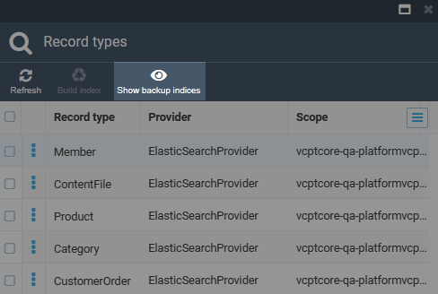

# Manage Search Index

To open search index details:

1. Click **Search Index** in the main menu.
1. The next blade displays:
    * The managed record types:
        * **Members**: Users or entities that have access to the platform.
        * **Content files**: Any type of digital content stored within the platform.
        * **Product**: The goods or services offered for sale within the Virto Commerce platform.
        * **Category**: Similar characteristics used to organize and classify products within the platform.
        * **Customer order**: Transactions where customers purchase products or services from the platform.

    * The search provider for each record type:
        * Elastic App Search.
        * Elasticsearch 8.
        * Lucene.
        * Elasticsearch.
        * Azure Cognitive Search.
        * Algolia.

        !!! note
            You can [tailor the search provider per document type](https://docs.virtocommerce.org/platform/developer-guide/Configuration-Reference/appsettingsjson/#search) to optimize search performance and functionality.

    * Last indexed date, record count, and scope if specified by the user:

    

## Build search index

To build search index:

1. Check the required record types from the list.
1. Click **Build index** in the top toolbar.
1. In the popup window, choose how you want to update the search index. There are two options available:
    * **Build**: Index all data without recreating.
    * **Delete and build**: Delete the existing search index and build a new one from scratch. 
    
    !!! Note
        No search results will be available until the build process is over.

The next blade displays the result of indexation:

## Blue-Green indexing

!!! note
    The blue-green indexing is supported by the ElasticSearch, Azure Search,  and the Elastic Search 8 modules. 
    {: width="25"} [Azure Search module](../azure-search/overview.md)

    {: width="25"} [Elastic Search module](../elastic-search/overview.md)
    
    {: width="25"} [Elastic Search 8 module](../elastic-search-8/overview.md)

After you choose **Delete and build** when building search index:

1. A new backup index is generated for the chosen document type.
1. The indexing operations are carried out on this backup index.
1. Throughout the full indexing process, the existing index remains unaffected, allowing uninterrupted search operations.
1. Once the reindexing is complete, a swap occurs: the backup index becomes active, while the previous index transitions to a backup role.

To revert to the previous index, use the **Swap indices** feature:

1. Click **Show backup indices** in the top toolbar.

    

1. Click on the three dots to the left of the required document type.
1. Select **Swap indices** in the popup menu.
1. Click **Hide backup indices** in the top toolbar.

    

The roles of the backup and active indices have been exchanged.

### Implementation details

Elasticsearch implements blue-green indexing using Elasticsearch [aliases](https://www.elastic.co/guide/en/elasticsearch/reference/current/indices-aliases.html). Search provider implementations use two aliases to distinguish one index role from the other: **active** and **backup**. The full index alias is built as **scope name + document type name + alias name**; for example, an active index alias for the **Members** index using the `default` scope will be `default-member-active`.

Each time you start the **Delete and build** process, the Elasticsearch index provider looks for an existing backup index by the backup alias, for example, `default-member-backup`, and deletes it if it is found. After that, when the reidnexing process starts, a new backup index is created with the `backup' alias. However, an actual index name is created dynamically: this is a special alphanumeric token suffix added to the end of the index name. The only way to tell which index is active is to look at its alias. After the indexing process is complete, the active and backup indices swap aliases, i.e. the active index becomes the backup index, and vice versa.

