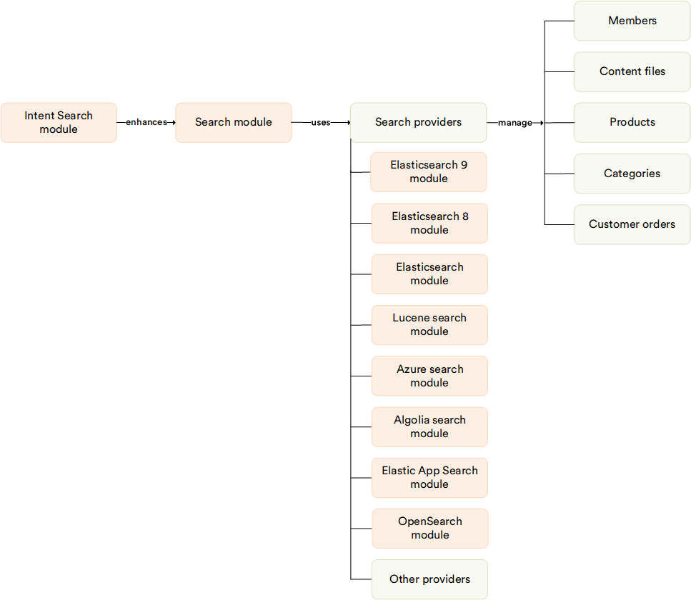

# Overview

The **Search** module (called **Search Index** in the Platform menu) provides a comprehensive solution for indexed search functionality, offering full-text search capability, extensible document models, and multi-document support. It enables efficient indexing, querying, and management of search data for various ecommerce entities, empowering administrators to optimize search experiences for end-users.

## Search architecture

The Virto Commerce search stack has two layers that work together:

* [Search providers](#providers) store indexed documents and execute queries. They are the engine-level components described in this section.
* [Intent Search](../intent-search/overview.md) is an optional AI-powered pre-processing layer that sits above the search providers. It analyzes natural-language queries before they reach the provider, extracting structured filters, facets, and semantic meaning to improve result relevance.

The two layers are independent. Any search provider can be used with or without Intent Search.

## Providers

The Search module defines common abstractions for indexed search functionality across various search engines, providing flexibility and scalability for ecommerce search solutions. The Virto Commerce Platform is search provider agnostic, allowing different search modules to be installed separately to better meet user preferences. Create a custom search provider to integrate with the search engine or choose from a range of well-known search engines:

* [Elasticsearch 9](../elastic-search-9/overview.md): Latest-generation provider built on the official .NET Elasticsearch client, compatible with Elasticsearch 9.x and 10.x (including Elastic Cloud deployments).
* [Elasticsearch 8](../elastic-search-8/overview.md): Supports [Elasticsearch 8.x and 9.x](/platform/developer-guide/latest/Fundamentals/Indexed-Search/integration/elastic-search-8). 
* [Elasticsearch](../elastic-search/overview.md): Version compatible with Elasticsearch 7.x.
* [OpenSearch](../opensearch/overview.md): A search provider leveraging OpenSearch and Amazon OpenSearch Service to store indexed documents.
* [Elastic App Search](../elastic-app-search/overview.md): Preferred search provider with rich no-code search customization and analytics tools.
* [Lucene](../lucene/overview.md): Recommended for local development mode.
* [Azure Cognitive Search](../azure-search/overview.md): A fully managed cloud search service offered by Microsoft Azure that enables developers to build powerful search capabilities into applications without the need for managing infrastructure. 
* [Algolia](../algolia/overview.md): A cloud-based search platform that provides developers with a set of APIs to easily implement fast and relevant search experiences in their applications. 

!!! note
    There should be at least one search engine installed.

!!! note
    You have two installation options for search providers:

    * Begin by installing the **Search** module, then add the required search provider module.
    * Alternatively, install the required search provider module, and the **Search** module will be automatically installed alongside it.

The diagram below illustrates the functionality of the Search module:

{: style="display: block; margin: 0 auto;" }

{: width="25"} [Configuring Search Settings](/platform/developer-guide/latest/Configuration-Reference/appsettingsjson)

## Key features

With the **Search** module:

* Full-text search capability is provided.
* Extensible document model is available.
* Multi-document support is implemented, enabling indexing and search across multiple entities such as Products, Categories, Members, and Orders.
* Blue Green indexation methodology is used.
* Indexation logs are generated.
* Native integration with the Admin Back Office is included.

 
 
********

    <a href="../../return/overview">← Return module overview</a>
    <a href="../managing-search">Managing search index →</a>

