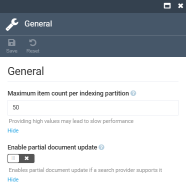
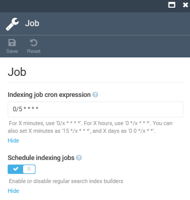

# Settings

To open the **Search** module settings:

1. Click **Settings** in the main menu.
1. In the search field of the next blade, type **Search** to find the settings related to search modules.
1. Click **General** to configure the following settings:

    {: style="display: block; margin: 0 auto;" }

1. Click **Job** to configure the following settings.

    {: style="display: block; margin: 0 auto;" }

1. Click **Save** in the top toolbar to save the changes.

The settings have been saved.

 
 
********

    <a href="../managing-search">← Managing search index</a>
    <a href="../../elastic-search-9/overview">Elasticsearch 9 module overview→</a>

