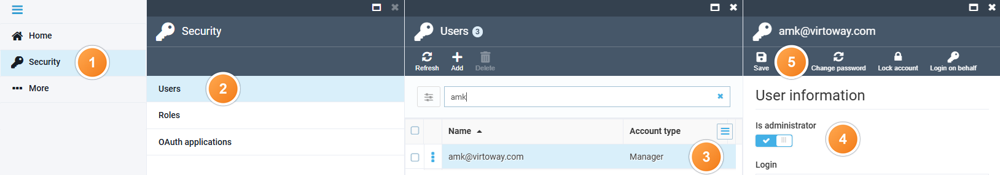

# Administrator

An administrator has full access to the Virto Commerce Platform. Administrators can work with every module, create and edit users, and assign roles and permissions. After you install the Platform, one administrator account is created automatically. Only an administrator can grant administrator rights to other users.

To grant administrator rights to an existing user:

1. Click **Security** in the main menu.
1. In the next blade, click **Users** to open the **Users** blade.
1. Select the required user.
1. In the **User information** blade, enable the **Is administrator** option to on.
1. Click **Save** in the toolbar.

    

The user is now an administrator.

 
 
********

    <a href="../roles-and-permissions">← Managing roles and permissions</a>
    <a href="../marketer">Marketer →</a>

