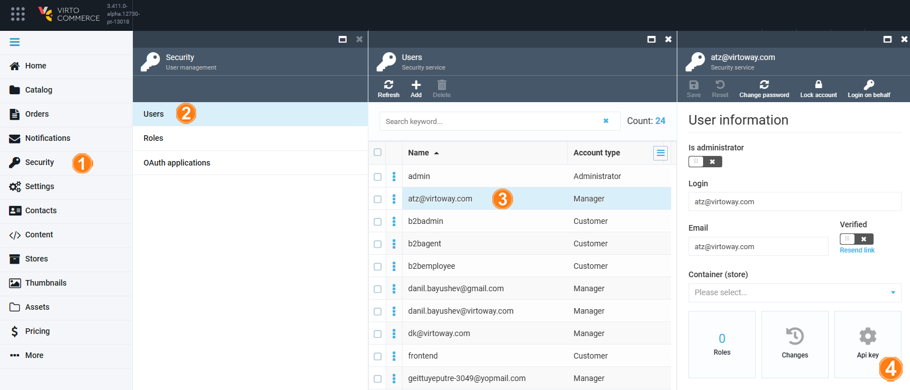
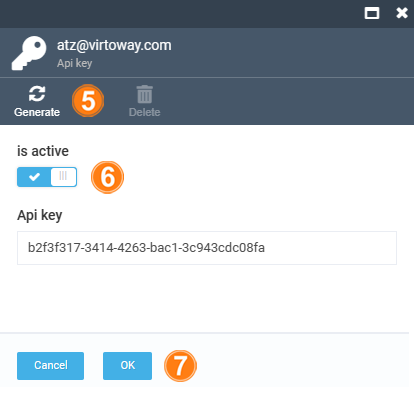

# Generating API Key

To generate an API key for API authentication of a user you have created: 

1. Click **Security** in the main menu.
1. In the next blade, click **Users** to open the **Users** blade.
1. Select the required user. 
1. In the **User information** blade, click on the **API key** widget.

	

1. In the **Api key** blade, click **Generate** in the toolbar. The new API key appears.
1. Switch the **Is active** option to on to activate the key. If you deactivate your API key, the system will not allow API calls using the old key. If you deactivate and then reactivate your API key, the system will not allow the old key and will generate a new API key instead.
1. Click **OK** to save the changes.

	{: width="350"}

1. Click **Save** in the **User information** blade.

The API key has been generated.

 
 
********

    <a href="../category-manager">← Category manager</a>
    <a href="../login-on-behalf">Login on behalf →</a>

