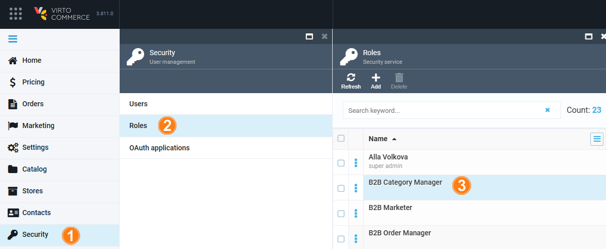
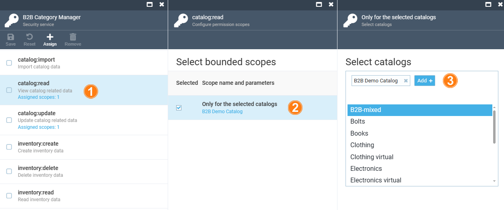
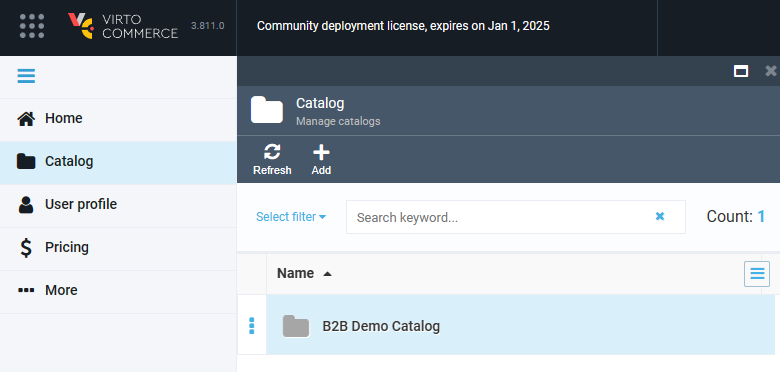

# Overview

In this guide, we are going to explore the role of a category manager and permissions that can be assigned to them. The category manager is responsible for organizing and optimizing the presentation of products to enhance the shopping experience and drive sales. 

## Assign permissions to category manager

To assign permissions to category manager:

1. In the main menu, click **Security**.
1. In the next blade, click **Roles**.
1. In the next blade, click **B2B Category Manager**.

    

1. Check the permissions you want to assign to your category manager and click **Save** in the toolbar.

In our case, the list of basic permissions to be assigned to your category manager can be divided into the following groups:

* **Bulk actions related permissions**:
    * Changing categories.
    * Updating properties.
    * Execute actions.

    !!! note 
        Configuration of bulk actions requires preinstalled [Bulk Actions module](https://github.com/VirtoCommerce/vc-module-bulk-actions/releases).

* **Catalog related permissions**:
    * Opening catalog menu.
    * Managing filters.
    * Creating catalog related data.
    * Deleting catalog related data. The scope of this permission can be limited to one or more catalogs.

        !!! note
            We recommend that you limit the permissions to delete data. Instead, use a deactivation feature that can be applied to any Virto Commerce item. This will help you avoid analytical errors.
    
    * Editing dictionary values of property. If there is a superior manager who does this, limit the permissions to edit dictionary values to prevent unwanted changes.

    * Viewing catalog related data. The scope of this permission can be limited to one or more catalogs.

* **Inventory related permissions**: Viewing customer data. The scope of this permission can be limited to one or more organizations.

* **Pricing related permissions**: Managing dynamic associations data.

* **Store related permissions** to view store data. The scope of this permission can be limited to one or more stores.

### Limit permission scope

With the Virto Commerce Platform, you can limit scopes of specific permissions to specific catalogs, organizations, or stores. Let's explore how to limit permissions of a category manager to view catalog related data to specific catalogs:

1. Click **Catalog:read. Assigned scopes**. 
1. In the next blade, click **Only for the selected catalogs**. 
1. In the next blade, select the catalogs to which you want to limit the scope of your category manager.

Now the category manager can only work with the specified catalogs. Similarly, you can limit the scopes of other permissions.

!!! note
    Above are basic permissions for category managers. You can assign any other permissions to them as needed.

For category managers, the platform will only display modules for which they have permissions:

{: width="25"} [Managing categories](../catalog/managing-categories.md)
