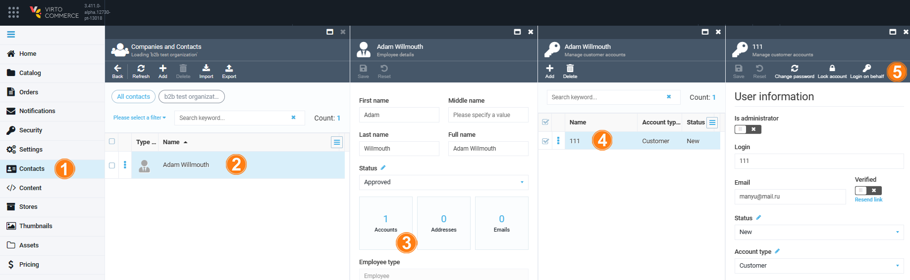
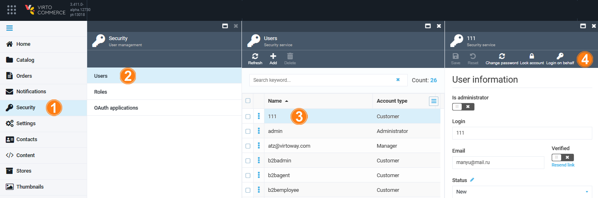
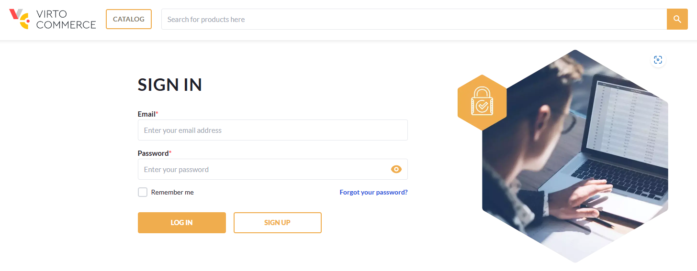

# Login on Behalf

If you are an administrator or support engineer responsible for maintaining a Virto Commerce-based web store, you can use our **Login on behalf** feature. This feature allows you to log in as another user, which can be helpful for:

* Assessing what a user sees on a webpage.
* Assisting with order placement.
* Making payments on their behalf, and more.

!!! note
	All actions performed through the **Login on Behalf** feature are strictly logged to avoid potential customer claims.

## How it works

The **Login on behalf** feature enhances the efficiency of your web store operations and significantly contributes to customer satisfaction and brand loyalty, while reducing cart abandonment rates.

When a user encounters issues with order processing or identifies a bug, support engineers often require a view of the user's perspective. This becomes especially crucial when dealing with application errors, which can be challenging to reproduce.

Moreover, **Login on behalf** enables experienced users to guide staff through the application. For instance, an administrator can assist a salesperson in bulk-adding products from an Excel file.

To log in on behalf of another user, sign into Virto Commerce portal as an administrator. Make sure the admin role and the respective permissions have been assigned properly. You can log in on behalf of another user via the **User information** blade. It can be accessed via the **Contacts** or **Security** module.

=== "Contacts module"

    To access the **User information** blade via the Contacts module:

	1. Click **Contacts** in the main menu.
	1. In the next **Companies and Contacts** blade, select the required contact.
	1. In the next **Contact details** blade, click the **Accounts** widget.
	1. In the next blade, select the required account from the list.
	1. The **User information** blade appears. Click **Login on behalf** in the toolbar.  

		

=== "Security module"

    To access the **User information** blade via the Security module:

	1. Click **Security** in the main menu.
	1. In the next **User management** blade, click **Users**.
	1. In the next **Users** blade, select the required account from the list.
	1. The **User information** blade appears. Click **Login on behalf** in the toolbar.  

		{: style="display: block; margin: 0 auto;" width="900"}

The Frontend application will open in a new window and prompt you to re-enter your credentials for security purposes:

{: style="display: block; margin: 0 auto;" width="750"}

 
 
********

    <a href="../api-key">← Generating API key</a>
    <a href="../active-sessions">Managing active sessions →</a>

