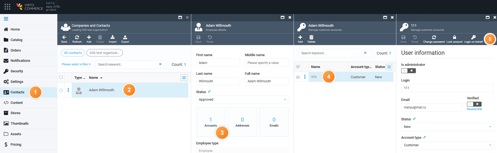
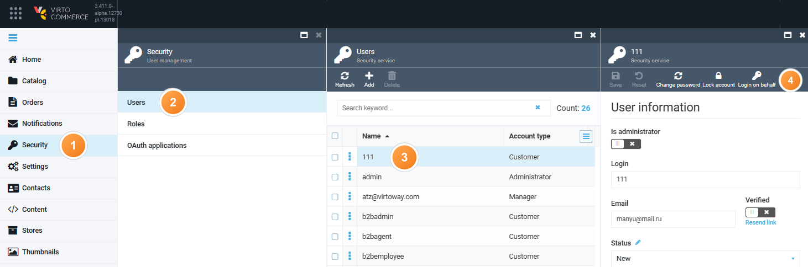
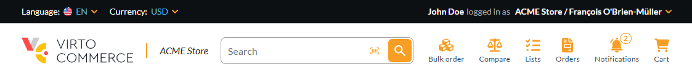

# Log in on Behalf

The **Login on behalf** feature lets you sign in as another user and act on their behalf without ever seeing or entering their password. It serves two audiences:

* **Administrators and support engineers** can log in as any user from the Platform to assess what a customer sees, assist with order placement, make payments on the customer's behalf, and reproduce hard-to-diagnose issues.
* **Authorized organization members** can open the Frontend as a colleague from the same organization to keep that colleague's work moving while they are away. They can browse the catalog, complete carts, place orders, and use the company account features.

!!! note
	All actions performed through the **Login on behalf** feature are strictly logged to avoid potential customer claims.

## How it works

To log in on behalf of another user, sign into Virto Commerce portal as an administrator. Make sure the admin role and the respective permissions have been assigned properly. You can log in on behalf of another user via the **User information** blade. It can be accessed via the **Contacts** or **Security** module.

=== "Contacts module"

    To access the **User information** blade via the Contacts module:

	1. Click **Contacts** in the main menu.
	1. In the next **Companies and Contacts** blade, select the required contact.
	1. In the next **Contact details** blade, click the **Accounts** widget.
	1. In the next blade, select the required account from the list.
	1. The **User information** blade appears. Click **Login on behalf** in the toolbar.  

		

=== "Security module"

    To access the **User information** blade via the Security module:

	1. Click **Security** in the main menu.
	1. In the next **User management** blade, click **Users**.
	1. In the next **Users** blade, select the required account from the list.
	1. The **User information** blade appears. Click **Login on behalf** in the toolbar.  

		{: style="display: block; margin: 0 auto;" width="900"}

The Frontend application will open in a new window and prompt you to re-enter your credentials for security purposes.

On the Frontend, you will be identified you as the operator and the user you are acting as:

{: style="display: block; margin: 0 auto;" width="750"}

### Permissions

To use **Login on behalf** on the Frontend:

* Your role must include the **Login on behalf** permission.
* You must be signed in to the Frontend as your own operator account first.
* The action is exposed on the **Company** > **Members** page only.

Only members who already have a security (login) account are valid targets. Members shown in the table but who have never signed in, and so have no security account, cannot be impersonated from this screen.

Permissions live on roles, not on individual user accounts. To grant a Company Maintainer or Employee access, see [Roles and permissions](roles-and-permissions.md).

The change takes effect on the operator's next action, with no sign-out required. Removing the permission from the role removes the action for everyone in that role, effective on their next attempt.

 
 
********

    <a href="../api-key">← Generating API key</a>
    <a href="../active-sessions">Managing active sessions →</a>

