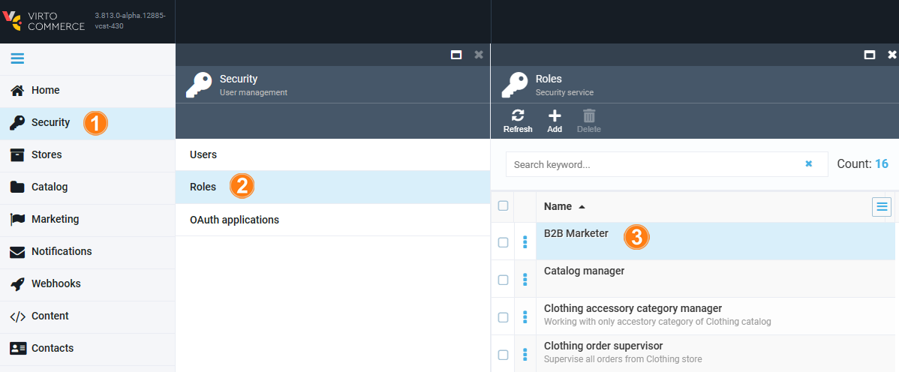
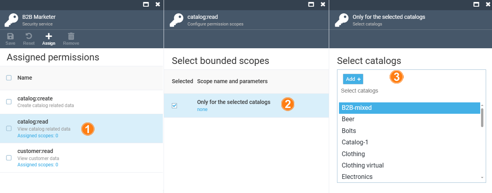
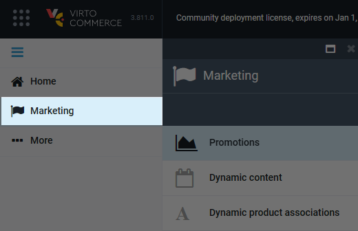
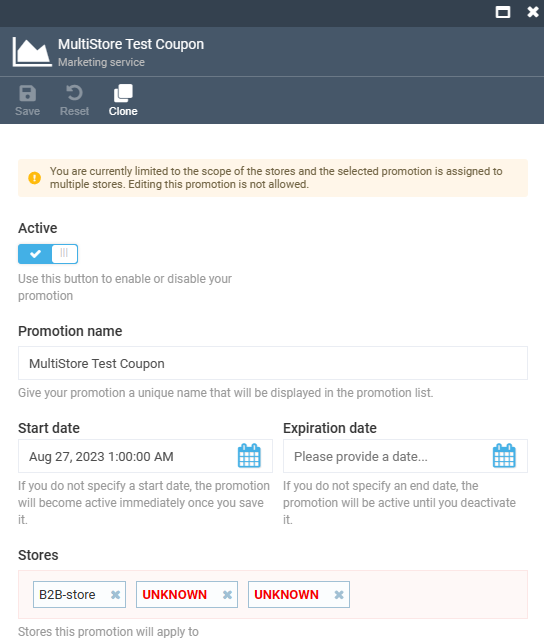

# Overview

In this guide, we are going to explore the marketer's role and permissions that can be assigned to them. The marketer's role in online commerce primarily revolves around crafting strategies to attract and engage customers. They focus on creating dynamic associations between products and running promotions to optimize sales and enhance the shopping experience.

## Assign permissions to marketer

To assign permissions to your marketer:

1. In the main menu, click **Security**.
1. In the next blade, click **Roles**.
1. In the next blade, click **B2B Marketer**.

    

1. Check the permissions you want to assign to your marketer and click **Save** in the toolbar.

In our case, the list of basic permissions to be assigned to your marketer can be divided into the following groups:

* **Catalog related permissions**:
    * Creating catalog related data.
    * Viewing catalog related data. The scope of this permission can be limited to one or more catalogs.

* **Customer related permissions**: Viewing customer data. The scope of this permission can be limited to one or more organizations.

* **Dynamic associations related permissions**: Managing dynamic associations data.

    !!! note 
        Configuration of dynamic associations requires preinstalled [Dynamic Associations module](https://github.com/VirtoCommerce/vc-module-dynamic-associations/releases).

    !!! note
        The dynamic associations permissions can be assigned to any user other than a marketer. 

* **Marketing related permissions**:
    * Opening marketing menu.
    * Creating or deleting marketing data.
    * Viewing marketing data. The scope of this permission can be limited to one or more stores.

* **Platform related permissions**:
    * Uploading platform assets.
    * Reading platform settings.

* **Store related permissions** to view store data. The scope of this permission can be limited to one or more stores.

### Limit permission scope

With the Virto Commerce Platform, you can limit scopes of specific permissions to specific catalogs, organizations, or stores. Let's explore how to limit marketer's permissions to specific catalogs:

1. Click **Catalog:read. Assigned scopes**. 
1. In the next blade, click **Only for the selected catalogs**. 
1. In the next blade, select the catalogs to which you want to limit your marketer's scope.

Now the marketer can only work with the specified catalogs. Similarly, you can limit the scopes of other permissions.

!!! note
    Above are basic permissions for marketers. You can assign any other permissions to them as needed.

For marketers, the Platform will show only one module in the main menu:

## Example

Let's say we have a marketer who is only responsible for B2B-store promotions, while a top-level marketer can create promotions for multiple stores, including the B2B-store. As long as the marketer's permission is limited to the B2B-store, they can only view the promotions created by the top marketer and that are active for multiple stores. They will receive notifications if they try to edit these promotions. The store names other than B2b-store will be hidden.

With this feature, top marketers prevent unwanted modifications of created promotions.   
