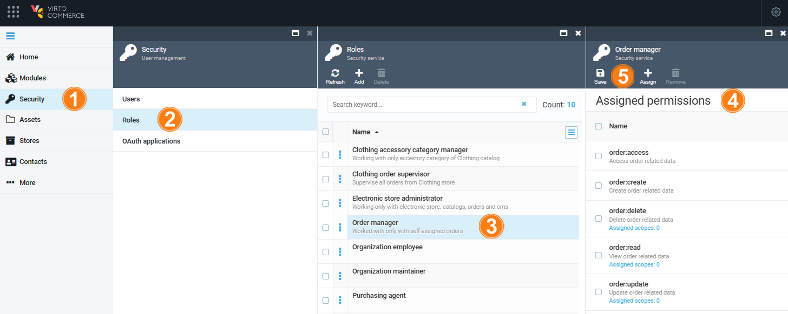
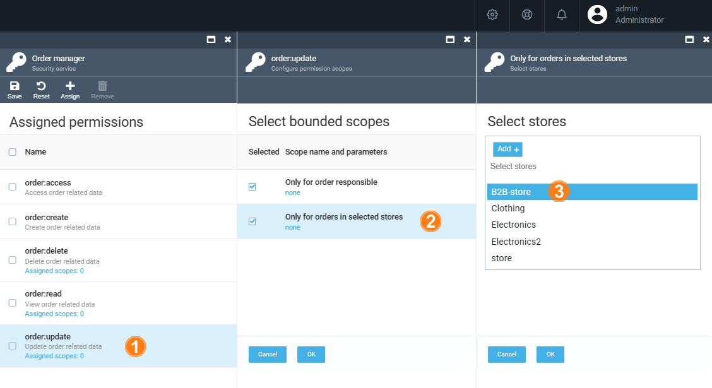
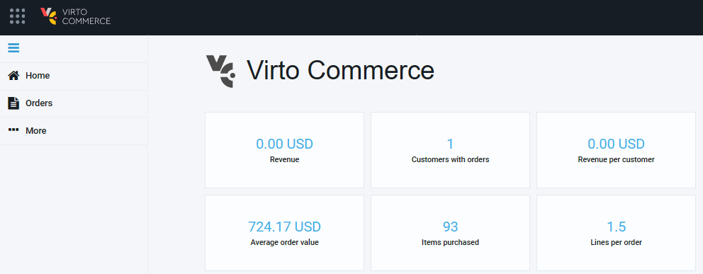

# Overview

In this guide, we are going to explore the role of an order manager and permissions that can be assigned to them. The order manager is responsible for overseeing and managing orders within the system. 

## Assign permissions to order manager

To assign permissions to your order manager:

1. In the main menu, click **Security**.
1. In the next blade, click **Roles**.
1. In the next blade, click **Order manager**.
1. Check the permissions you want to assign to your order manager. 

    !!! note
        In our case, the list of basic permissions to be assigned to your order manager includes **Order related permissions** to create/ delete/ view/ update and access orders. You can assign any other permissions to them as needed.

1. Click **Save** in the top toolbar.

    {: style="display: block; margin: 0 auto;" }

### Limit permission scope

With Virto Commerce Platform, you can limit certain permissions to be assigned only to those responsible for orders or to orders in specific stores. Let's explore how to limit the order manager's permission to update order related data to B2B-store:

1. Click **order:update** permission. 
1. In the next blade, click **Only for orders in selected stores**. 
1. In the next blade, select the B2B-store from the dropdown list.

    {: style="display: block; margin: 0 auto;" }

1. In both blades, click **OK** to save the changes.

Now the order manager can only work with the specified store. Similarly, you can limit the scopes of other permissions.

For order managers, the platform will only display modules for which they have permissions:

{: style="display: block; margin: 0 auto;" }

{: width="25"} [Managing Orders](../order-management/overview.md)

 
 
********

    <a href="../marketer">← Marketer</a>
    <a href="../category-manager">Category manager →</a>

