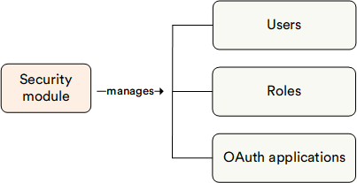

# Overview

The **Security** module provides various options to manage security and authentication for your online store or website. This includes managing:

* **Users**: Individuals with access to your Platform or store.
* **Roles**: Sets of permissions defining specific functions within the Platform, such as basic user, advanced user, administrator, order manager, etc.
* **Permissions**: Fundamental security units that grant particular rights to perform actions, such as viewing customer details or changing order data.
* **Scopes**: Restrictions of permissions to specific objects or actions.

## Key features

The diagram below illustrates the interconnections among various key entities within the Security module:

{: style="display: block; margin: 0 auto;" }

With the Security module, you can:

* [Create user accounts](managing-users.md#create-new-user).
* [Assign various roles to users](managing-users.md). Each role includes specific granular permissions that give or restrict access to specific features within the Platform. This is useful when you want to restrict access to a specific store or do not want regular Platform users to edit sensitive data.
* [Generate API keys](api-key.md) for specific users.
* [Log in to the Frontend Application on behalf](login-on-behalf.md) of any user.

 
 
********

    <a href="../../search/overview">← Search module overview</a>
    <a href="../managing-users">Managing user accounts →</a>

