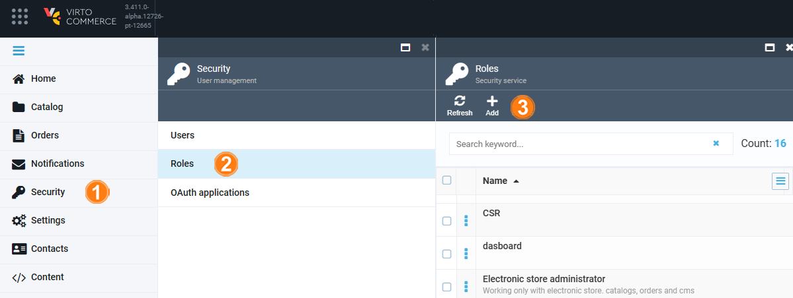
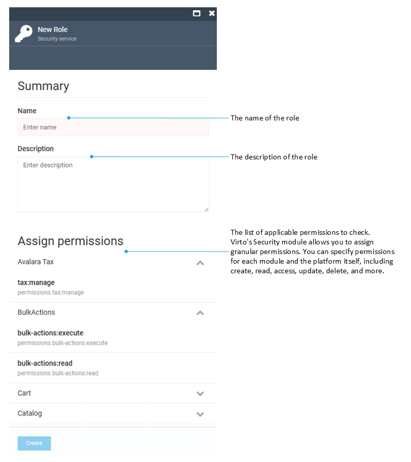

# Roles and Permissions

In Virto Commerce Platform, each user must have at least one role assigned. Virto Commerce offers pre-defined roles by default, which you can customize or create new ones according to your needs.

Managing roles includes:

* [Creating new roles and assigning permissions.](roles-and-permissions.md#create-new-role)
* [Editing new roles.](roles-and-permissions.md#edit-roles)

## Create new role and assign permissions

To create new roles and assign permissions to them:

1. Click **Security** in the main menu.
1. In the next blade, click **Roles** to open the **Roles** blade.
1. Click **Add** in the toolbar.

	{: style="display: block; margin: 0 auto;" }

1. Fill in the following fields:

	{: style="display: block; margin: 0 auto;" }

1. Click **Create** to save the changes.

The new user has been added to the list in the **Roles** blade.

## Edit roles

To edit a role:

1. Follow steps 1-2 from the instruction above.
1. Click the required role and edit it in the next blade: assign new permissions or delete the existing ones.
1. Click **Save** in the toolbar to save the changes.

The role has been modified.

 
 
********

    <a href="../managing-users">← Managing user accounts</a>
    <a href="../marketer">Marketer →</a>

