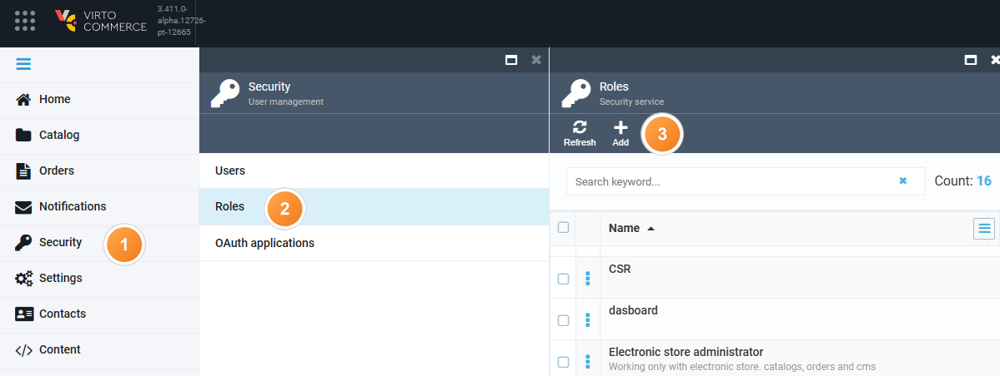
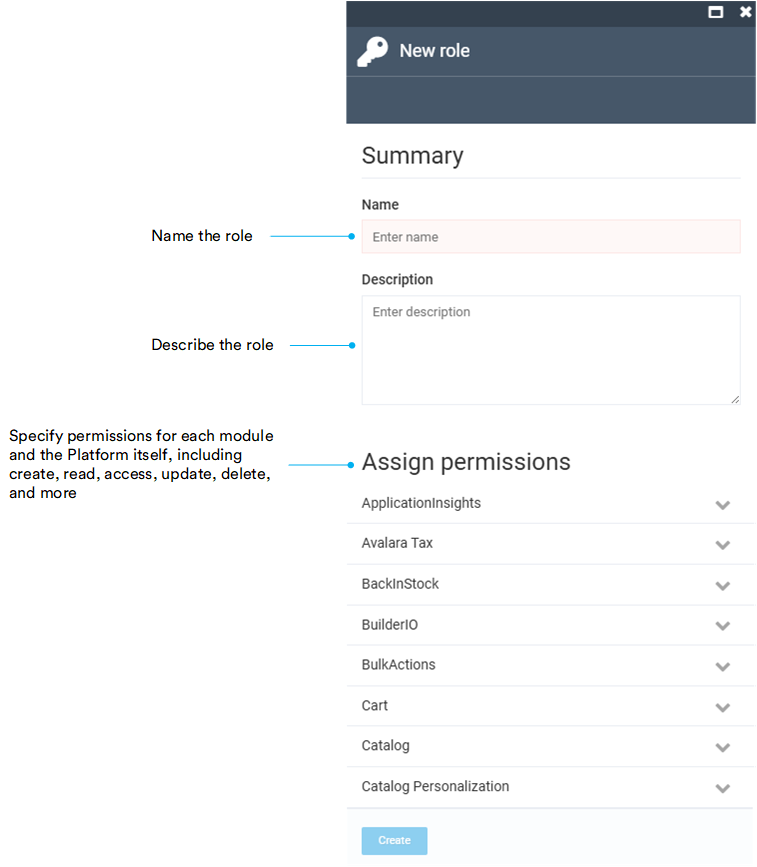

# Roles and Permissions

In Virto Commerce Platform, permissions are granted through roles. Virto Commerce offers pre-defined roles by default, which you can customize, or you can create new ones according to your needs.

Managing roles includes:

* [Understanding role scopes.](roles-and-permissions.md#role-scopes)
* [Creating new roles and assigning permissions.](roles-and-permissions.md#create-new-role)
* [Editing roles.](roles-and-permissions.md#edit-roles)

## Role scopes

A member's effective permissions are the union of three role sources, re-evaluated each time they sign in:

* **Global roles** are assigned to the user account itself in the Security module.
* [Organization roles](../contacts/managing-organization-roles.md#assign-organization-level-role) are assigned to a whole organization and inherited by all its employees.
* [Membership roles](../contacts/managing-organization-roles.md#assign-membership-role) are assigned to one person within one organization.

In this article we are going to explore the global roles assigned via the Security module.

{: width="25"} [Manage organization-scoped roles](../contacts/managing-organization-roles.md)

## Create new role and assign permissions

To create new roles and assign permissions to them:

1. Click **Security** in the main menu.
1. In the next blade, click **Roles** to open the **Roles** blade.
1. Click **Add** in the toolbar.

	{: style="display: block; margin: 0 auto;" }

1. Fill in the following fields:

	{: style="display: block; margin: 0 auto;" }

1. Click **Create** to save the changes.

The new role has been added to the list in the **Roles** blade.

## Edit roles

To edit a role:

1. Follow steps 1-2 from the instruction above.
1. Click the required role and edit it in the next blade: assign new permissions or delete the existing ones.
1. Click **Save** in the toolbar to save the changes.

The role has been modified.

## Granular catalog entity permissions

Catalog access can be configured separately for categories and products within a catalog. A role can be granted full write access to categories while limiting products to read-only, or vice versa. This replaces the umbrella `catalog:*` permissions that cover both entity types together.

Eight permissions are registered under the **Catalog** group in the role editor:

| Permission | Purpose |
| --- | --- |
| `catalog:categories:create` | Create categories |
| `catalog:categories:read` | View categories |
| `catalog:categories:update` | Edit categories |
| `catalog:categories:delete` | Delete categories |
| `catalog:products:create` | Create products |
| `catalog:products:read` | View products |
| `catalog:products:update` | Edit products |
| `catalog:products:delete` | Delete products |

All permissions are localized for the 13 Platform languages.

### Catalog scope

The new permissions support the existing **Selected catalog** scope. For example, a role can be granted `catalog:categories:update` only for Catalog A. Operations on entities outside the user's scoped catalogs return HTTP 403.

### Behavior in admin UI

The **Catalog** blade and detail blades respect entity-level permissions:

* The unified catalog list filters automatically to show only the entity types the user can read.
* Toolbar actions like **Add**, **Cut**, **Paste**, and **Delete** appear only for entity types the user has the corresponding permission for.
* **Save** and **Reset** on the category detail blade require `catalog:categories:update`. On the product detail blade, they require `catalog:products:update`.
* **Add variation** and **Delete variation** depend on `catalog:products:create` and `catalog:products:delete`.
* Read-only users still see **Copy ID** and **Copy SKU** actions.

### Backward compatibility

Existing roles that use the legacy `catalog:create`, `catalog:read`, `catalog:update`, and `catalog:delete` permissions continue to work unchanged. The Platform automatically maps each legacy permission to both entity-level equivalents:

| Legacy permission | Maps to |
| --- | --- |
| `catalog:create` | `catalog:categories:create` + `catalog:products:create` |
| `catalog:read` | `catalog:categories:read` + `catalog:products:read` |
| `catalog:update` | `catalog:categories:update` + `catalog:products:update` |
| `catalog:delete` | `catalog:categories:delete` + `catalog:products:delete` |

No migration is required for existing roles.

## Catalog linking permissions

Two permissions control whether a role can link entities into virtual, curated catalogs and categories. They extend the [granular catalog entity permissions](#granular-catalog-entity-permissions) above, splitting the linking action by entity type. A role can be allowed to link categories but not products, or the reverse.

| Permission | Purpose |
| --- | --- |
| `catalog:categories:link` | Link categories to other categories or catalogs. |
| `catalog:products:link` | Link products and variations to categories or catalogs. |

Linking happens in the virtual catalog mapping flow. Open a virtual catalog or category, use **Add > Link**, pick a physical catalog, then click **Map** to open the **Choose categories and items for mapping** picker.

### Configure linking permissions

To control linking for a role:

1. [Open or create a role](#create-new-role-and-assign-permissions).
1. Grant the permissions the role needs:

	* `catalog:products:link` lets the role link products and variations only.
	* `catalog:categories:link` lets the role link categories only.
	* Grant both for unrestricted linking, which matches the previous behavior.

1. Assign the role to the relevant users, for example a **Merchandising** role.

The role can now link only the entity types you granted.

### Mapping picker behavior

In the **Choose categories and items for mapping** picker, the role's linking permissions are enforced:

* Rows whose entity type the role cannot link are dimmed and non-selectable, with a warning banner that explains why.
* The backend enforces the same rule. Create-links and bulk-create-links requests return HTTP 403 for a disallowed entity type, so the restriction cannot be bypassed through the API.

A role that holds both linking permissions, like the administrator, sees no change. Both categories and products remain selectable.

!!! warning
    Linking previously required `catalog:categories:update` or `catalog:products:update`. It now requires the new `catalog:categories:link` and `catalog:products:link` permissions. Grant the matching link permission to any existing role that relied on the update permissions for linking, otherwise linking returns HTTP 403 for that role. Reaching the mapping picker through **Add --> Link** also requires a create permission (`catalog:create`, `catalog:categories:create`, or `catalog:products:create`).

 
 
********

    <a href="../managing-users">← Managing user accounts</a>
    <a href="../administrator">Administrator →</a>

