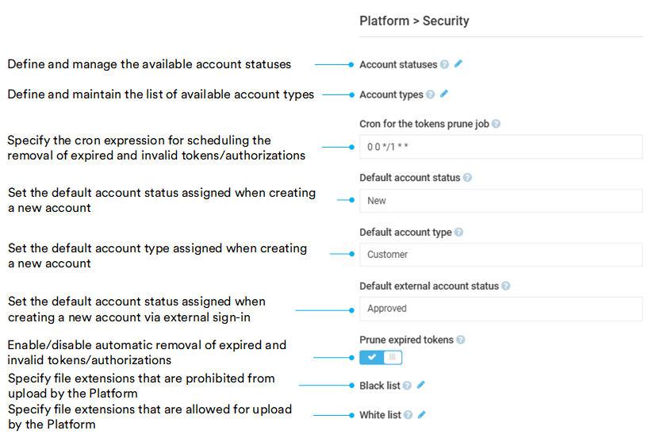

# Settings

To open the **Security** module settings:

1. Click **Settings** in the main menu.
1. In the search field of the next blade, type **Security** to find the settings related to search modules.
1. In the next blade, configure the following settings:

    {: style="display: block; margin: 0 auto;" }

1. Click **Save** in the toolbar to save the changes.

Your modifications have been applied.

 
 
********

    <a href="../managing-search">← Managing search index</a>
    <a href="../../intent-search/overview">Intent Search module overview →</a>

