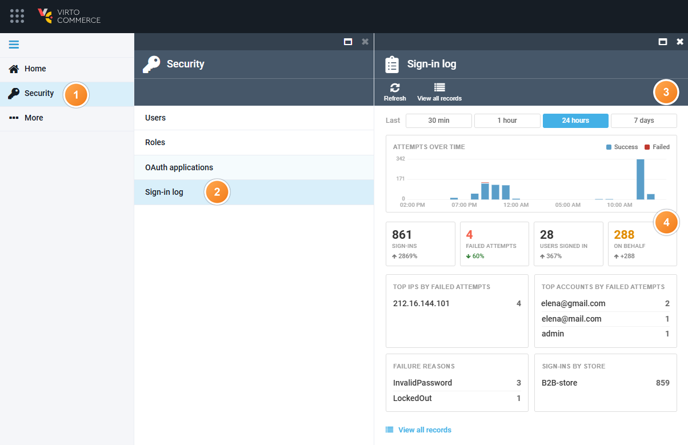
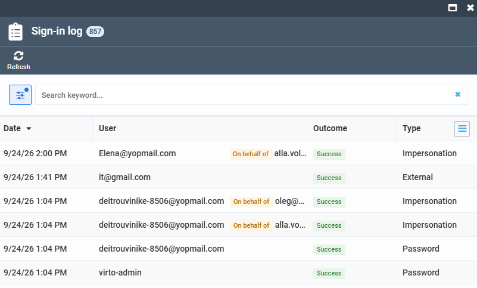
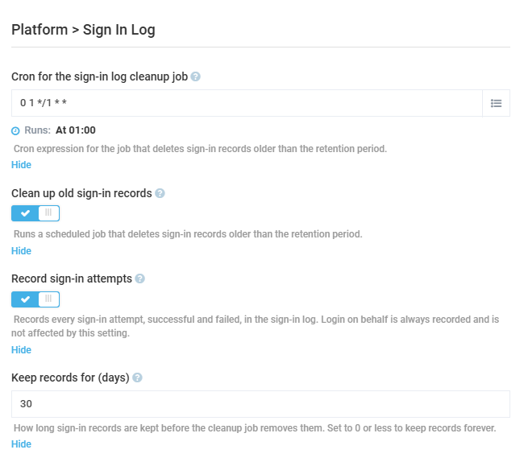

# Sign-in Log

The platform now keeps a durable record of every successful and failed sign-in attempt including sessions started through **Login on behalf**. 

The following logs are recorded:

| Entry point | What is recorded | 
|-------------|------------------|
|Back office sign-in and sign-out | Success   Wrong password   Unknown user name   Locked-out account   Sign-out | 
| Token endpoint, password grant | Success   Wrong password   Unknown user name   Locked-out account   Password login disabled   Expired password | 
| External identity provider (SSO) | Success and failure with the provider name |
| Login on behalf | Grant   Revert back to the operator   Denied attempt   Attempt against a user that does not exist |

To view the sign-in log:

1. Click **Security** in the main menu.
1. In the next blade, select **Sign-in log**.
1. View the logs for the past 30 minutes, 1 hour, 24 hours, and 7 days. 
1. The widgets display a short summary of sign-ins, failed attempts, signed in users, and logs on behalf of other users. The widgets are clickable:

    {: style="display: block; margin: 0 auto;" }

1. Click any widget to see a detailed log:

    {: style="display: block; margin: 0 auto;" }

Each record carries the date, the user name as it was typed, the outcome, the failure reason if any, the sign-in type, the operator for on-behalf rows, IP address, host, user agent, store and member. Names are stored as they were at the time, so a later rename does not rewrite history. Deleting a user account does not delete their records.

## Settings

To open the **Sign-in log** settings:

1. Click **Settings** in the main menu.
1. In the search field of the next blade, type **Sign-in log** to find the settings related to the feature.
1. In the next blade, configure the following settings:

    {: style="display: block; margin: 0 auto;" }

1. Click **Save** in the toolbar.

Your modifications have been applied.

 
 
********

    <a href="../active-sessions">← Managing active sessions</a>
    <a href="../settings">Settings →</a>

