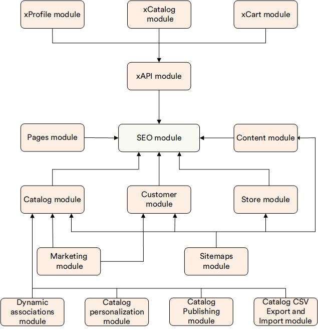

# Overview

The **SEO** module provides a flexible infrastructure for managing SEO-related data across the Platform. It supports SEO metadata (e.g., slugs, titles, meta descriptions) for various entities such as catalogs, categories, products, and custom pages.

## Key features

- **SEO info lookup**: Efficient retrieval of SEO records matching given criteria such as `permalink`, `storeId`, `language`, and others.
- **Best match resolution**: Logic to determine the most relevant SEO entry when multiple matches are found.
- **Duplicate detection**: Extensible interface `ISeoDuplicatesDetector` for identifying and resolving conflicting SEO entries.
- **Broken links detection and management**: Identify and report dead or misconfigured SEO links.

 
The diagram below illustrates which modules use SEO module:

{: style="display: block; margin: 0 auto;" }

 
 
********

    <a href="../../security/overview">← Security module overview</a>
    <a href="../../catalog/managing-SEO">Managing SEO →</a>

