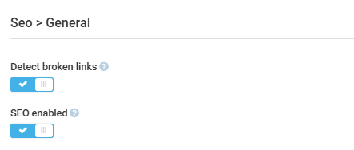

# Settings

To configure the **SEO** module settings:

1. Click **Settings** in the main menu.
1. In the search field of the next blade, type **SEO** to find the settings related to the module.
1. Click **General**.
1. In the next blade, enable or disable broken links detection or the SEO feature:

    {: style="display: block; margin: 0 auto;" }

1. Click **Save** in the toolbar to save the changes.

Your modifications have been applied.

 
 
********

    <a href="../debugging-seo-links">← Debugging SEO links</a>
    <a href="../../shipping/overview">Shipping module overview →</a>

