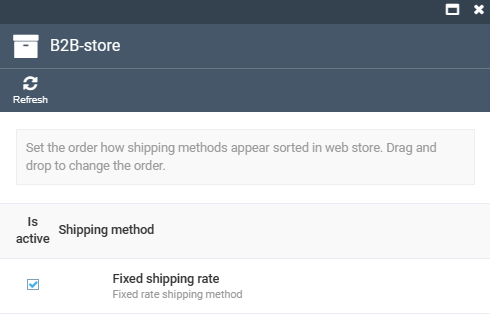
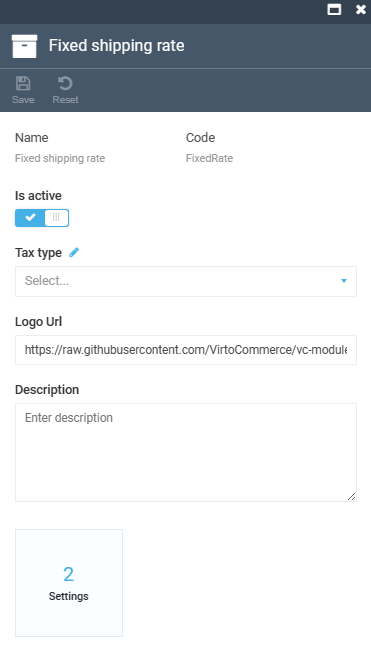
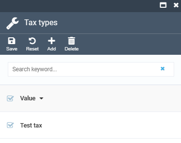

# Manage Shipping Methods

Managing shipping methods includes:

* [Selecting available shipping methods from the list.](managing-shipping-methods.md#select-shipping-method)
* [Editing shipping method.](managing-shipping-methods.md#editing-shipping-methods)
* [Selecting tax providers.](managing-shipping-methods.md#configure-tax-provider)

## Select Shipping Method

To select a shiping method:

1. In the main menu, click **Stores**.
1. In the next blade, select the required store.
1. In the next blade, click on the **Shipping methods** widget.
1. The next blade displays the available shipping methods. Curently, we offer a fixed rate shipping method. 

## Editing Shipping Methods

To edit a shipping method:

1. Complete steps 1-4 from the instruction above and click on the required shipping method from the list.
1. In the next blade:
    * Enable/disable the shipping method.
    * Select tax type from the dropdown list.
    * Specify logo URL.
    * Enter shipping method description.

    

1. Click **Save** in the toolbat to save the changes.

Your changes have been applied to the shipment method.

## Configure Tax Provider

To configure a tax provider:

1. Complete steps 1-2 from the instruction above.
1. Click  next to the **Tax type** field.
1. In the next blade:
    * Click **Add** in the toolbar to add a new tax type.
    * Click **Delete** in the toolbar to delete the unnecessary tax type.

1. Click **Save** in the toolbar to save the changes.

The tax provider has been configured.
