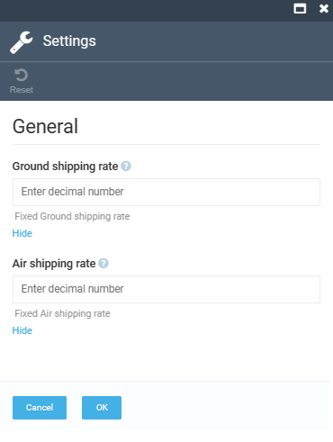
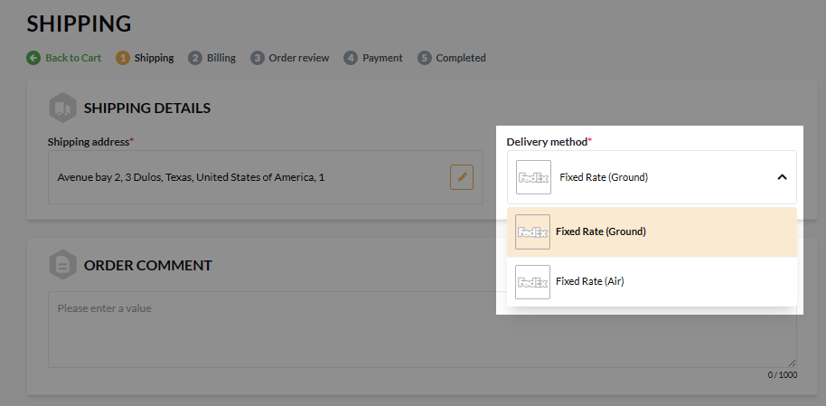

# Settings

To configure the **Shipping** module settings:

1. In the main menu, click **Stores**.
1. In the next blade, select the required store.
1. In the next blade, click on the **Shipping methods** widget.
1. In the next blade, select the required shipping method from the list.
1. In the next blade, click on the **Settings** widget.
1. In the next blade, configure the following settings:

    

The modifications become available in the Frontend Application:

 
 
********

    <a href="../managing-shipping-methods">← Managing shipping methods</a>
    <a href="../../shopify-taxonomy/overview">Shopify Taxonomy module overview →</a>

