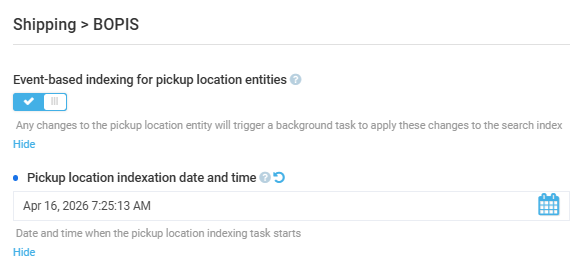
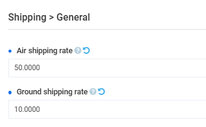
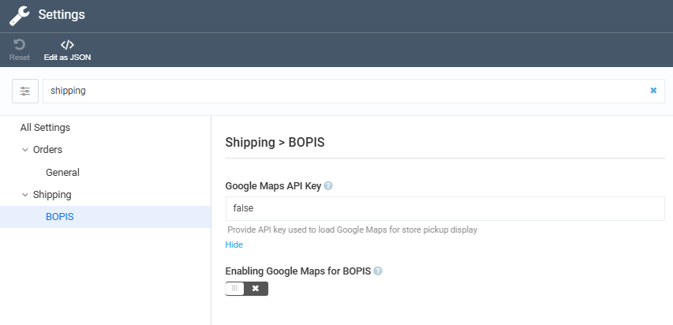

# Settings

For the Shipping module, you can configure:

* [Global shipping settings.](#global-shipping-settings)
* [Fixed shipping rate.](#fixed-shipping-rate)
* [BOPIS settings.](#bopis-settings)

## Global shipping settings

To configure the Shipping module settings globally:

1. Click **Settings** in the main menu.
1. In the search field of the next blade, type **Shipping** to find the settings related to the module or simply click on it in the list.
1. Configure the following:

    {: style="display: block; margin: 0 auto;" }

1. Click **Save** in the toolbar to save the changes.

Your modifications have been applied.

 
 

## Fixed shipping rate

To configure the fixed shipping settings:

1. Open **Stores** from the main menu.
1. In the next blade, select  your store.
1. In the next blade, click on the **Shipping methods** widget.
1. In the next blade, click **Fixed shipping rate**
1. In the next blade, click on the **Settings** widget to configure the following:

    {: style="display: block; margin: 0 auto;" }

1. Click **OK**, then **Save** in the toolbar to save the changes.

Your modifications have been applied.

## BOPIS settings

To configure BOPIS settings:

1. Open **Stores** from the main menu.
1. In the next blade, select  your store.
1. In the next blade, click on the **Settings** widget.
1. Find **Shipping** settings in the left panel and click **BOPIS**:

    {: style="display: block; margin: 0 auto;" }

1. Click **OK**, then **Save** in the toolbar to save the changes.

 
 
********

    <a href="../managing-shipping-methods">← Managing shipping methods</a>
    <a href="../../shipstation/overview">ShipStation module overview →</a>

