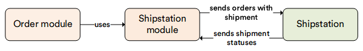

# Overview

The **ShipStation** module enables synchronizing customer orders with [ShipStation](http://www.shipstation.com/). This means that new orders with shipments placed in VirtoCommerce will become available in the ShipStation admin, and changes in shipment status will be synced with VirtoCommerce orders.

## Key features

With the ShipStation module, you can:

* Export orders specified by store.
* Update order and shipping statuses when ShipStation takes an action.

The diagram below illustrates the functionality of the ShipStation module:

{: width="25"} [About ShipStation](https://shipstation.com/)

{: width="25"} [Integration Guide](https://help.shipstation.com/hc/en-us/articles/360025856192-Custom-Store-Development-Guide)

 
 
********

    <a href="../../seo/overview">← SEO module overview</a>
    <a href="../../shipping/overview">Shipping module overview →</a>

