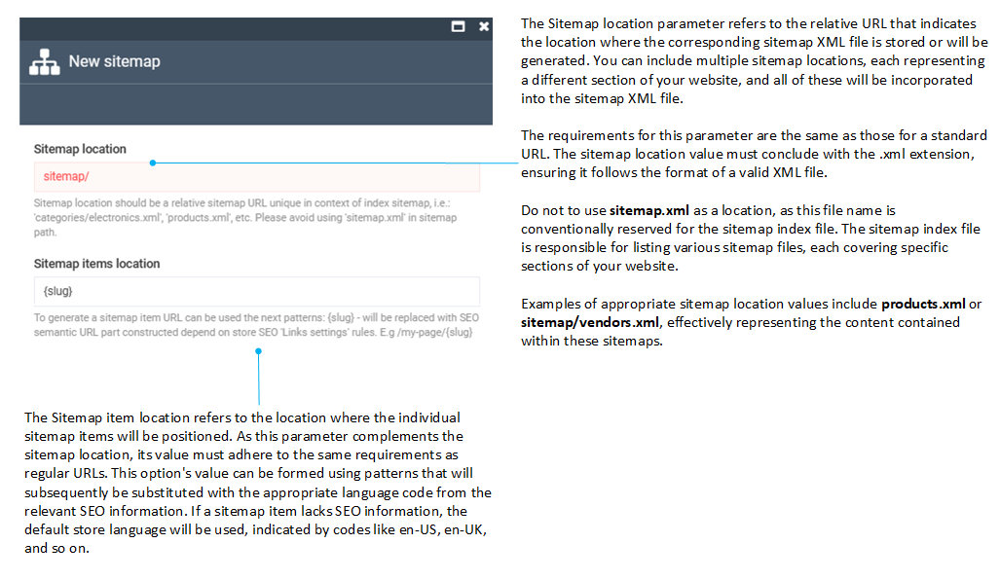

# Manage Sitemaps

Managing sitemaps includes:

* [Adding new sitemaps to stores](configuring-sitemaps.md#add-new-sitemap-to-store)
* [Adding sitemaps items](configuring-sitemaps.md#add-sitemap-items)
* [Downloading sitemaps](configuring-sitemaps.md#download-sitemaps)

To manage the store sitemaps:

1. In the main menu, click **Stores**.
1. From the list of stores, click the store you need to manage sitemaps for.
1. In the next blade, click the **Sitemaps** widget. 
1. In the next **Sitemaps** blade, you will see a list of sitemaps to be included into the sitemap index file.


## Add new sitemap to store

To add a new sitemap: 

1. Click **Add** in the toolbar.
1. Fill in the following fields:

    

1. Click **Create** to save the changes.

The example below involves three sitemap locations for different types of pages. The sitemap item locations are determined using language-culture slugs.

```xml linenums="1"
<sitemapindex xmlns:xhtml="http://www.w3.org/1999/xhtml" xmlns="http://www.sitemaps.org/schemas/sitemap/0.9">
  <sitemap>
    <loc>https://sitemaps/en-US/sitemap/vendor.xml</loc>
  </sitemap>
  <sitemap>
    <loc>https://sitemaps/en-US/sitemap/catalog.xml</loc>
  </sitemap>
  <sitemap>
    <loc>https://sitemaps/en-US/sitemap/blog.xml</loc>
  </sitemap>
</sitemapindex>
```

## Add sitemap items

To add sitemap items:

1. Select a sitemap from the list.
1. In the next blade, click the  **Add items** in the toolbar.
1. Select the items to be added to the sitemap:

	

1. Click **Save** to save the changes.

## Download sitemaps

After creating your sitemap, you can download a ZIP package containing your sitemap(s) in order to view what it includes:

1. Click **Download sitemaps** in the top toolbar.

1. In the new window, enter base URL for sitemaps and confirm your action.

The ZIP package you have downloaded contains the **sitemap.xml** file with the sitemap locations (see the example above) and the sitemap item XML files:


Each sitemap item file includes the corresponding URL with a specific language culture:

```xml linenums="1"
<urlset xmlns:xhtml="http://www.w3.org/1999/xhtml" xmlns="http://www.sitemaps.org/schemas/sitemap/0.9">
  <url>
    <loc>https://vcplatform-storefront.qa.govirto.com/en-US/</loc>
    <changefreq>weekly</changefreq>
    <priority>0.5</priority>
  </url>
</urlset>
```
