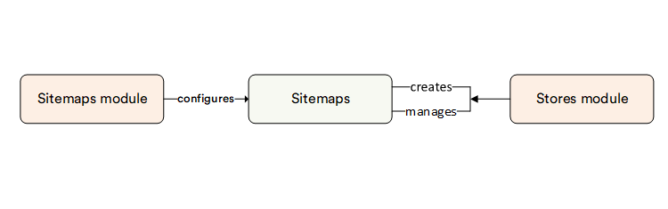

# Overview

Sitemaps are an essential tool for webmasters to communicate with search engines about the pages available on their websites for crawling and indexing. In its simplest form, a sitemap is an XML file that contains a list of URLs from the website, along with accompanying metadata. This metadata includes details such as the most recent modification date, the frequency of updates, and the relative priority of each URL. These elements collectively empower search engines to navigate and comprehend the website's structure more effectively.

Web crawlers primarily discover web pages through internal and external links. Sitemaps complement this process by providing an organized catalog of URLs that might not be as readily discoverable through links alone. Although employing the sitemap protocol doesn't guarantee immediate inclusion of web pages in search engine results, it does provide search engine crawlers with crucial guidance. This guidance assists in optimizing the crawling process, ensuring that significant and updated pages are appropriately indexed.

In essence, sitemaps contribute to a more seamless interaction between website owners and search engines, facilitating the optimal visibility of web pages within search engine results.

## Key features

The diagram below illustrates the Sitemaps module functionality:

With the Sitemaps module, you can:

* [Generate sitemap files on-the-fly by an API call, or manually](configuring-sitemaps.md#add-new-sitemap-to-store)
* [Create sitemaps based on catalog items, vendor items, custom or static content items](configuring-sitemaps.md#add-sitemap-items)
* [Schedule and configure a recurring job to generate sitemap files](settings.md)
* [Download sitemap ZIP packages with XML files](configuring-sitemaps.md#download-sitemaps)

 
 
********

    <a href="../../shipping/overview">← Shipping module overview</a>
    <a href="../configuring-sitemaps">Managing sitemaps →</a>

