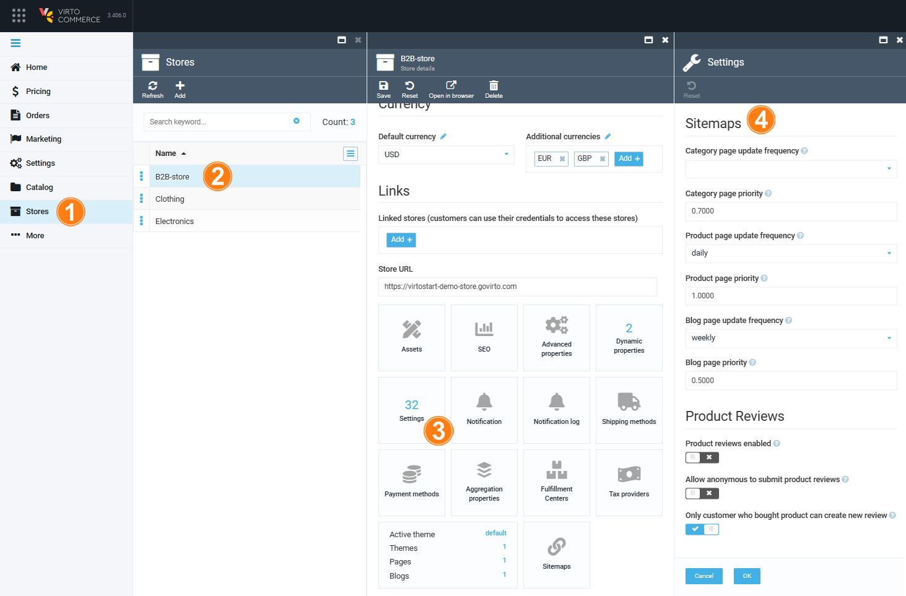

# Settings

The Sitemaps module settings include:

* [General settings](settings.md#general-settings)
* [Sitemaps settings](settings.md#sitemaps-settings)

## General settings

To configure general settings:

1. Click **Settings**.

1. Type **Sitemap** to find the settings related to the module.

1. Select **General** to configure the page size for export or import and enable/ disable logging of inventory changes

	

1. Click **Save** to save the changes.

## Sitemaps settings

To configure search settings: 

1. Click **Settings**.

1. Type **Inventory** to find the settings related to the module.

1. Select **Search** to enable or disable event-based indexing.

	

1. Click **Save** to save the changes.

## Set values via Store module

You can also set these values [at the Store level](https://docs.virtocommerce.org/new/user-guide/store/settings/#sitemaps-settings):

1. In the main menu, click **Stores**.
1. In the next blade, select the required store.
1. In the next blade, click the **Settings** widget:
1. Scroll down to the **Sitemaps** section and configure the settings.
	
1. Click **Ok** to save the changes.
1. Click **Save** to save the changes.

!!! note
	The priority and update frequency settings at the store level have a higher priority, which means they will override the settings specified at the module level.
