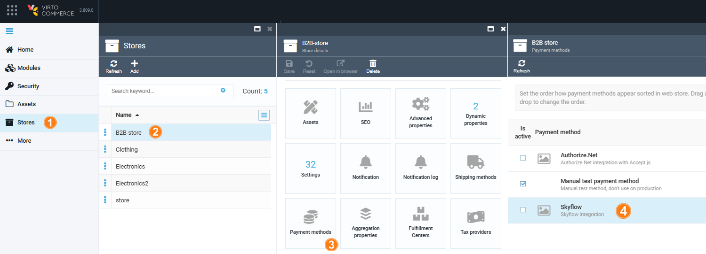
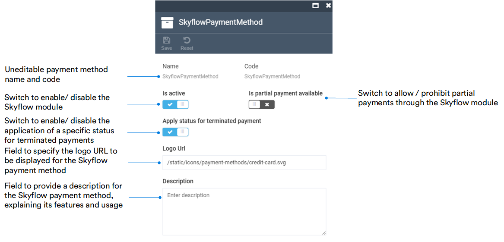

# Manage Skyflow Module

To manage the Skyflow payment method:

1. Click **Stores** in the main menu. 
1. In the next blade, select a store.
1. In the **Store details** blade, click on the **Payment methods** widget.

    !!! note
        You can set the order in which payment methods appear in the web store. Drag and drop them to change the order.

1. In the **Payment methods** blade, select **SkyFlow**.

    

1. In the **Edit payment method** blade, configure the following fields:

    

1. Click **Save** in the toolbar to save the changes.

Your modifications have been saved.

 
 
********

    <a href="../overview">← Skyflow module overview</a>
    <a href="../../authorize-net/overview">Authorize.net module overview →</a>

