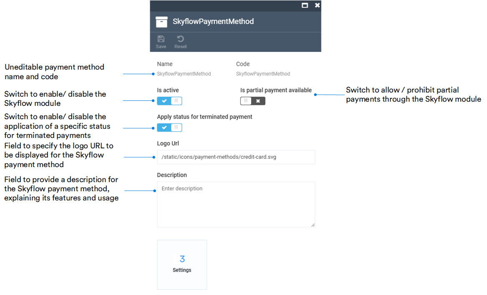

# Manage Skyflow module

Managing Skyflow module includes:

* [Editing payment method.](manage-skyflow-module.md#edit-payment-method)
* [Configuring module settings.](manage-skyflow-module.md#configure-settings)

## Edit payment method 

To edit Skyflow payment method:

1. Click **Stores** in the main menu. 
1. In the next blade, select a store.
1. In the **Store details** blade, click on the **Payment methods** widget.

    !!! note
        You can set the order in which payment methods appear in the web store. Drag and drop them to change the order.

1. In the **Payment methods** blade, select **SkyFlow**.

    

1. In the **Edit payment method** blade, configure the following fields:

    

1. Click **Save** in the toolbar to save the changes.

Your modifications have been saved.

## Configure settings

To configure the Skyflow module settings:

1. Complete steps 1-4 from the instruction above.
1. In the **Edit payment methods** blade, click on the **Settings** widget.
1. In the next blade, configure the following settings:

    

1. Click **OK** to save the changes.

Your modifications have been saved.
