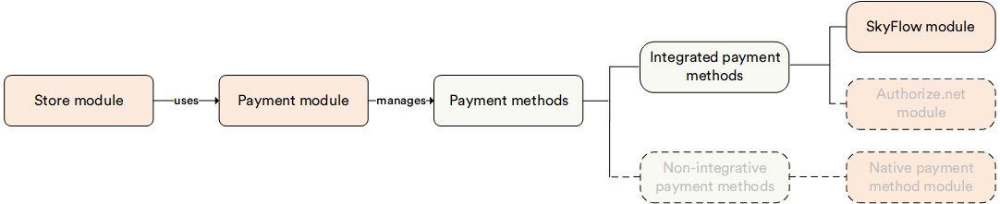

# Overview

The **Skyflow** module facilitates seamless integration with [SkyFlow](https://www.skyflow.com/), a Data Privacy Vault service, enabling secure payment processing within Virto Commerce Platform. This integration ensures compliance with industry standards for handling payment data securely while offering a unified experience for credit card transactions. 

## Key features

* **Unified credit card user experience:** Enhance user payment journeys with a consistent credit card transaction experience across multiple payment providers.
* **PCI compliance:** Ensure PCI compliance with SkyFlow, simplifying adherence to industry standards for secure payment data handling.
* **Integration with Virto Commerce Frontend application:** Seamlessly integrate with [Virto Frontend Application](https://github.com/VirtoCommerce/vc-theme-b2b-vue) to provide a cohesive e-commerce experience.
* **Flexible customization:** Utilize the flexibility of the Virto Commerce Native Extensibility Framework and SkyFlow to tailor integrations with a variety of payment providers to meet your specific requirements.
* **Optimized for marketplaces:** Streamline marketplace operations by effortlessly connecting with multiple Payment Service Providers, catering to diverse payment preferences for customers and suppliers.
* **Saved credit card:** Enhance convenience and checkout speed by offering customers the ability to securely save their credit card information for future transactions.

The diagram below illustrates the interconnections among various key entities within the Skyflow module:

{: width="25"} [Skyflow integration with Virto Commerce](../../../developer-guide/Fundamentals/Payments/skyflow)

 
 
********

    <a href="../../cybersource/overview">← CyberSource module overview</a>
    <a href="../manage-skyflow-module">Managing Skyflow →</a>

