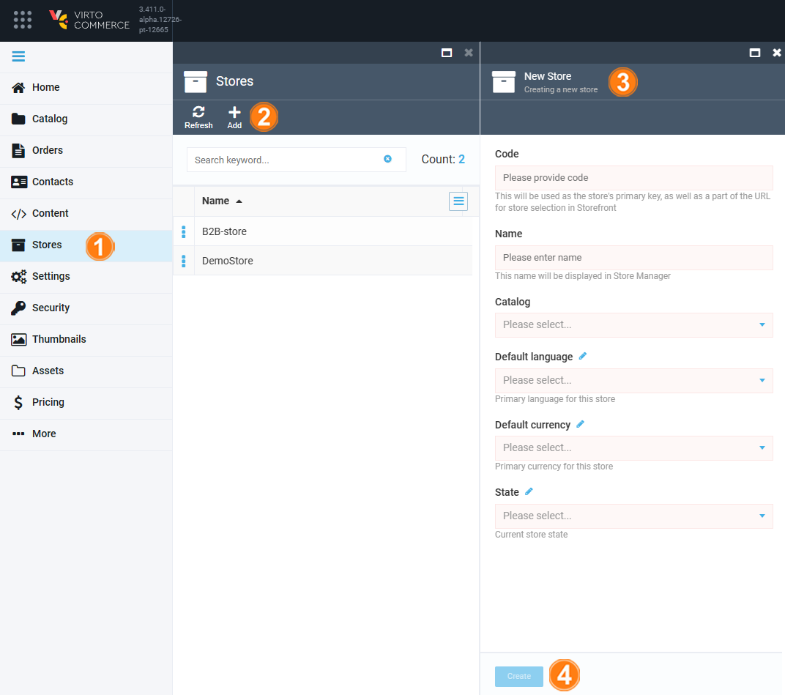

# Add New Store

To add a new store to your Virto Commerce system:

1. Click **Stores** in the main menu.
1. In the next **Stores** blade, click **Add** in the toolbar.
1. In the next **Store details** blade, fill in the required fields.

	!!! note
		**Code** is the identifier for your store. It will be included into its URL. Your code may include only alphanumeric characters, hyphens, and underscores. The use of alphanumeric characters allows you to create a meaningful store Id for the users. Once you create your store, the **Code** field becomes uneditable, so make sure to provide a relevant and convenient one before you click **Create**.

1. Click **Create** to save the changes.

{: style="display: block; margin: 0 auto;" width="800"}

Your new store has been added to the list.

 
 
********

    <a href="../overview">← Store module overview</a>
    <a href="../configuring-store">Configuring store →</a>

