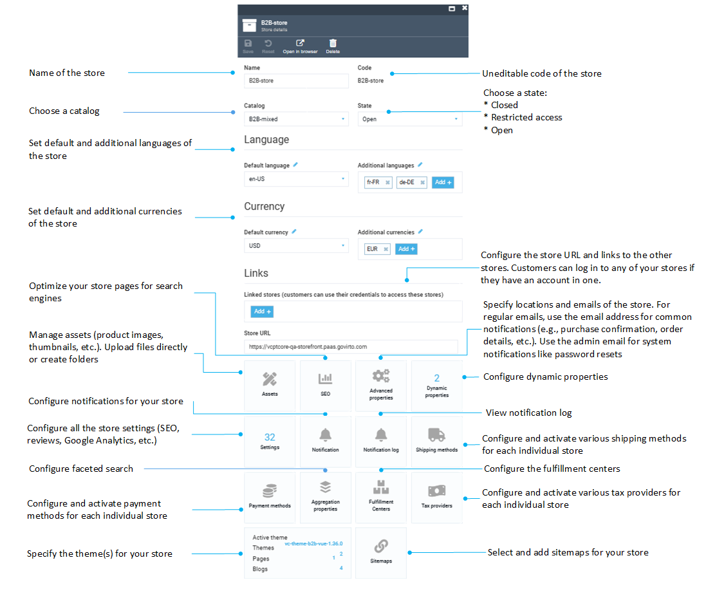
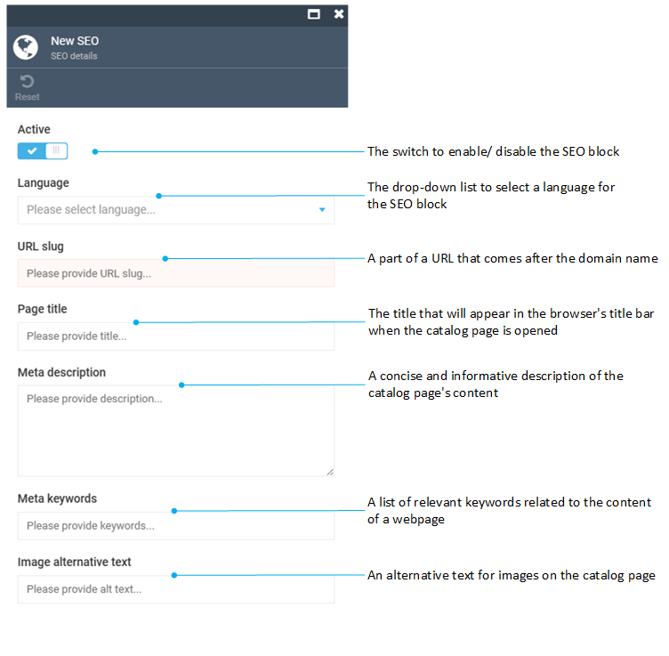
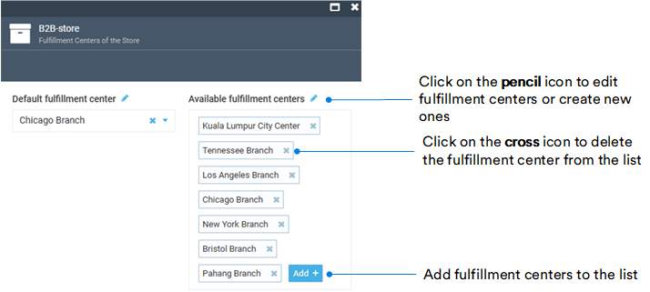

# Configure Store

To configure your store, select it in the **Stores** blade and modify the following fields:

{: width="25"} [Settings](settings.md)

{: width="25"} [Notifications](../notifications/overview.md)

{: width="25"} [Notifications Log](../notifications/notification-log.md)

{: width="25"} [Taxes](../integrations/avalara/overview.md)

{: width="25"} [Sitemaps](../sitemaps/overview.md)

{: width="25"} [Payment Methods](../payment/managing-payment-methods.md)

Below is additional information on some more widgets.

## SEO
You can have multiple SEO sets for your store pages. Each set includes meta title, meta description, keywords, URL slug, and more:

## Fulfillment centers

Clicking on the **Fulfillment Centers** widget opens the list of the store's fulfillment centers. 

To add a new fulfillment center, click **Add** in the toolbar and fill in the following fields:

{: width="600"}
