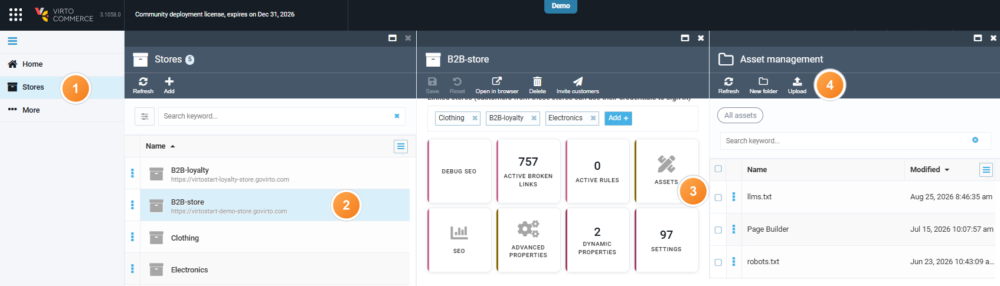

# Custom robots.txt File

You can upload a custom **robots.txt** file via the Virto Commerce Platform, which will override the system-generated one.

??? "About robots.txt file"

    The **robots.txt** file is a plain text file that tells search engine crawlers which pages they are allowed or disallowed to crawl and index. It helps prevent technical or sensitive sections of your site from appearing in search results.

    **Example**:

    ``` title="robots.txt"
    User-agent: *                               // Applies the rule to all crawlers
    Disallow: /admin/                           // Blocks indexing of the `/admin/` path 
    Disallow: /checkout/                        // Blocks indexing of the `/checkout/` path
    Allow: /                                    // Allows crawling of all other content
    Sitemap: https://example.com/sitemap.xml    // Provides the URL of your site’s sitemap to improve indexing
    ```


To upload your custom **robots.txt**:

1. Open **Stores** in the main menu.
1. In the next blade, select your store.
1. In the next blade, click on the **Assets** widget.
1. In the next blade, click **Upload** in the toolbar and upload your file.



Your file has been uploaded and overrides the system-generated one.

!!! note
    To serve different **robots.txt** files based on domain or language, we recommend creating separate stores for each domain and uploading a distinct **robots.txt** file to the **Assets** of each store. This approach allows each store to manage its own file.

## Environment policies

Use different crawl policies for production and non-production environments.

For production, allow crawling and point crawlers to the sitemap, while keeping session-specific routes out of the index:

``` title="robots.txt (production)"
User-agent: *
Disallow: /account
Disallow: /checkout
Disallow: /cart
Disallow: /sign-in
Allow: /
Sitemap: https://<your-storefront-domain>/sitemap/sitemap.xml
```

For demo, QA, and staging, block all crawling so the environment is never indexed:

``` title="robots.txt (non-production)"
# Restrictive policy for demo and QA environments
User-agent: *
Disallow: /
```

!!! warning
    `Disallow: /` blocks all crawling. Replace the non-production file with the permissive production policy before go-live. Behind a disallow-all **robots.txt**, dynamic rendering with Prerender.io delivers no SEO value.

Two things to keep in mind for the `Sitemap:` directive:

* The valid sitemap path is `/sitemap/sitemap.xml`, not `/sitemap.xml`. Use it in the `Sitemap:` directive and in any recache scripts.
* The sitemap is generated by the Platform **Sitemaps** module, not by the Frontend. Add sitemap items and export them to the store assets before the `Sitemap:` URL returns anything useful.

{: width="25"} [Manage sitemaps](../sitemaps/overview.md)

{: width="25"} [Enhancing SEO with Prerender.io](/storefront/developer-guide/latest/integrations/prerender_io/)

<br>
<br>
********

<div style="display: flex; justify-content: space-between;">
    <a href="../configuring-store">← Configuring store</a>
    <a href="../settings">Store settings →</a>
</div>
