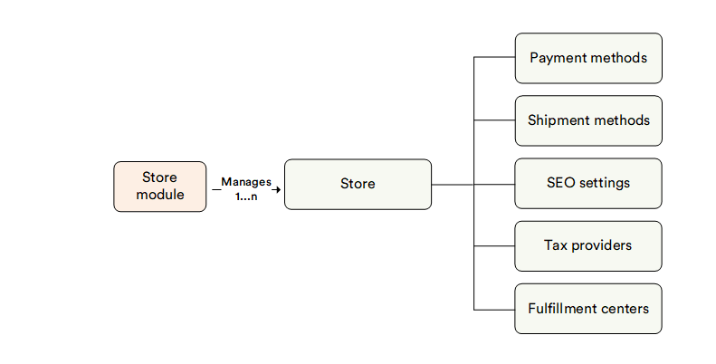

# Overview

The Virto Commerce Store (Stores) module is a way to efficiently manage your online stores from a single point.

A store in Virto Commerce is a collection of settings for your web page or website that converts it into the appropriate online store you need. For each store, you can configure an item catalog to display, available currencies, languages, payment methods, even UI themes, pages, and much more. The Virto Commerce team supplies default Frontend Application settings, as well as some sample stores to help you better understand how it works once you decide to build your own store with Virto.

## Key features

The diagram below illustrates the interconnections among various key entities within the Stores module:

With the Store module, you can:

* [Create any number of stores](adding-new-store.md)
* [Manage SEO settings](configuring-store.md#SEO)
* [Set individual payment and shipping methods](configuring-store.md)
* [Manage tax providers](configuring-store.md)
* [Linking customer accounts across stores](configuring-store.md)

