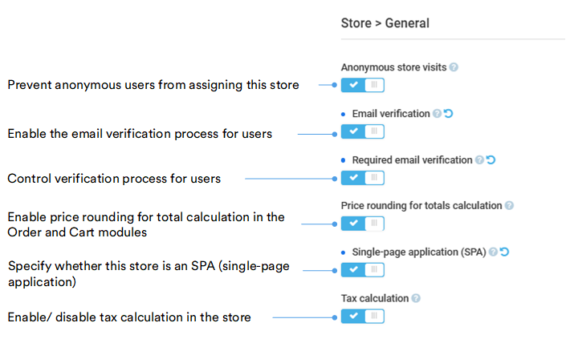
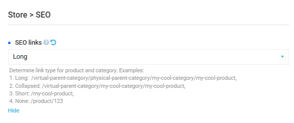
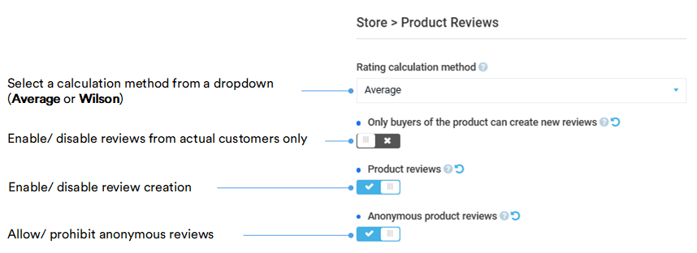
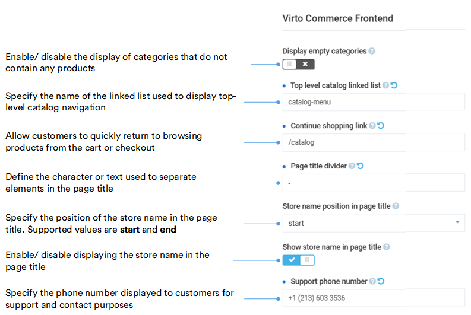
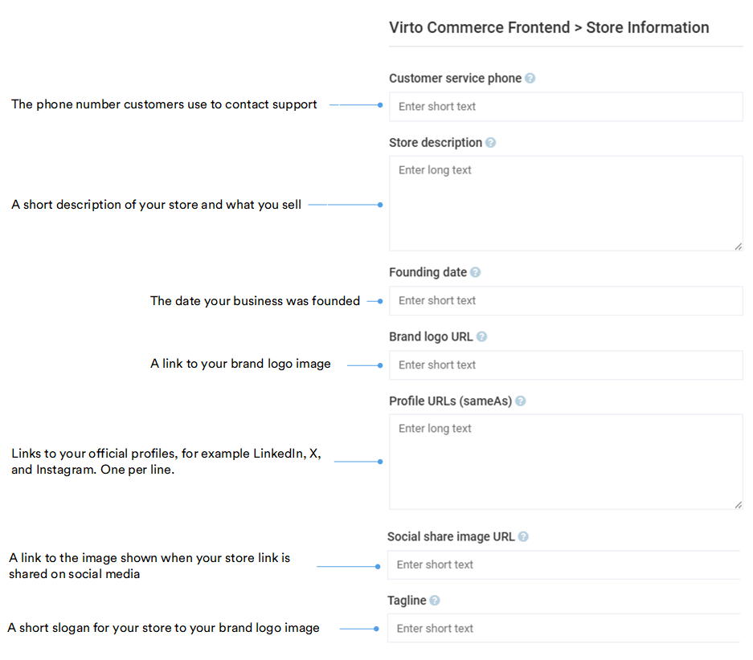
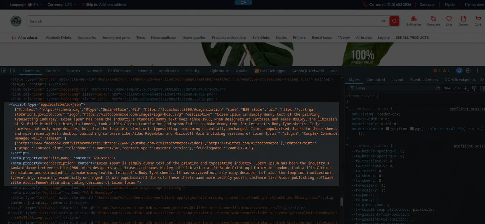

# Settings

You can configure the module settings through the **Settings** widget in the **Store details blade** (**Stores** -->Your store -->**Settings**).

All settings related to the store, including the store settings themselves, are collected here. In this guide, we describe only store-specific settings. Settings related to the store but belonging to other modules are covered in the [Settings articles of the respective modules](#other-settings).

## General settings

{: style="display: block; margin: 0 auto;" }

## SEO settings

{: style="display: block; margin: 0 auto;" }

## Products reviews

{: style="display: block; margin: 0 auto;" }

## Frontend settings

The Frontend settings define how the Frontend behaves and how customer-facing elements such as navigation, page titles, and display options are configured:

{: style="display: block; margin: 0 auto;" }

### Store information

Store Information defines your brand identity: name, logo, contact details, and social profiles. Fill it in so search engines and AI agents recognize your store. Shared links then show a proper title, description, and preview image on social media.

To configure it, open the **Store Information** section of the Frontend settings and fill in the fields:

{: style="display: block; margin: 0 auto;" }

This is how these details appear on the Frontend:

{: style="display: block; margin: 0 auto;" }

For the technical details of the brand markup these settings produce, see [Organization structured data](/storefront/developer-guide/latest/spa-architecture-for-seo-and-404-handling/#organization-structured-data-schemaorg).

Your store now presents a complete brand identity to customers, search engines, and AI agents.

## Other settings

Other store-specific settings include:

* [AI Document Processing settings.](../ai-doc-processing/settings.md)
* [Application Insights settings.](../application-insights/enable-app-insights.md)
* [Back in stock settings.](../back-in-stock/settings.md)
* [BOPIS settings.](../shipping/settings.md#bopis-settings)
* [Builder.io settings.](../integrations/builder-io/settings.md)
* [Cart settings.](../cart/settings.md)
* [Catalog settings.](../catalog/settings.md)
* [Customer settings.](../contacts/settings.md)
* [Google Analytics 4 settings.](../integrations/google-analytics/settings.md)
* [Loyalty settings.](../loyalty/enable-and-configure-loyalty-programs.md)
* [News settings.](../news/settings.md)
* [Page Builder settings.](../page-builder/settings.md)
* [Orders settings.](../order-management/settings.md)
* [Push messages settings.](../push-messages/settings.md)
* [Quotes settings.](../quotes/settings.md)
* [Recommendations settings.](../recommend/settings.md)
* [Return settings.](../return/settings.md)
* [Shipping settings.](../shipping/settings.md)
* [Sitemap settings.](../sitemaps/settings.md)
* [Subscriptions settings.](../subscription/settings.md)
* [White labeling settings.](../white-labeling/settings.md)

 
 
********

    <a href="../custom-llms-txt">← Custom llms.txt file</a>
    <a href="../../pricing/overview">Pricing module overview →</a>

