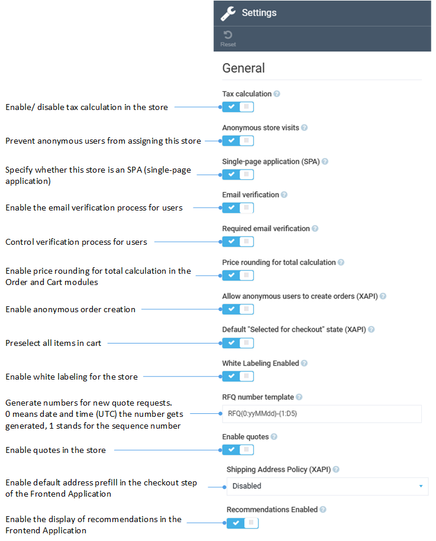
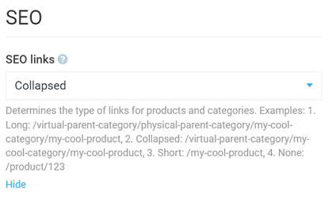

# Settings

You can configure the module settings through:

* Settings widget in the **Store details blade** (**Stores -->Your store -->Settings**).
* Settings section in the main menu (**Settings-->Store**).

In both the widget and the settings section, you will find fully or partly similar settings.

## General settings

## SEO settings

## Products settings

Turn this option to on to display the **Purchased before** filter for products on the frontend:

This setting activates the logic to enrich the product index with customer purchase history. It also extends the product index schema with a new field: `__purchase_by_user_<StoreId>`, containing user IDs of customers who have previously purchased the product:

[Rebuild the product index](../catalog/product-indexing.md) to populate the `__purchase_by_user_<StoreId>` fields with historical data.

To update the index with the corresponding user IDs upon new order creation, [trigger an update via the event](../order-management/settings.md#products-settings) after the order has been successfully created.

## Other settings

Other store-specific settings are:

* [Orders templates settings](../order-management/settings.md#orders-templates-settings).
* [Statuses](../contacts/settings.md#statuses).
* [Return settings](../return/settings.md).
* [Google Analytics 4 settings](../integrations/google-analytics/settings.md).
* [Application Insights settings](../application-insights/enable-app-insights.md).
* [Sitemap settings](../sitemaps/settings.md), etc.

