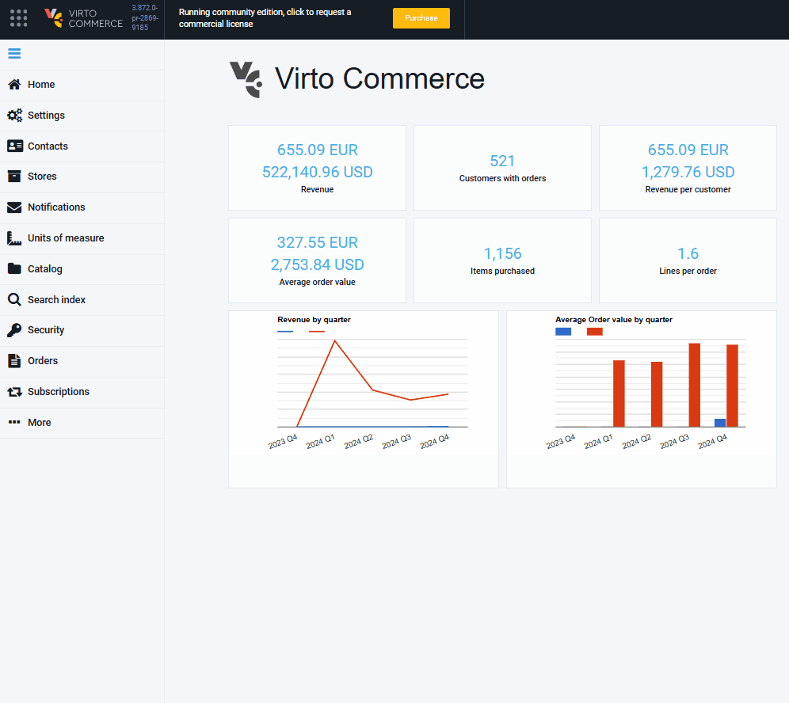

# Enable Subscriptions

To enable subscriptions :

1. Click **Settings** in the main menu.
1. In the next blade, select settings related to the **Subscriptions** module.
1. Click **Subscriptions**.
1. In the next blade, switch the **Subscriptions activation** option to on.
1. Click **Save** in the toolbar to save the changes.

Now, you can sell subscription-based offerings.

{: style="display: block; margin: 0 auto;" }

You can [configure other settings](settings.md).

 
 
********

    <a href="../overview">← Subscription module overview</a>
    <a href="../settings">Settings →</a>

