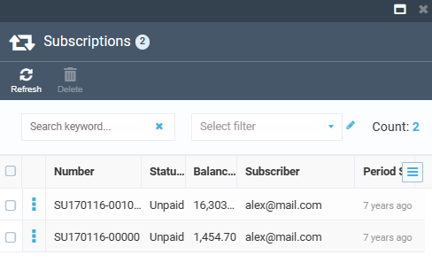
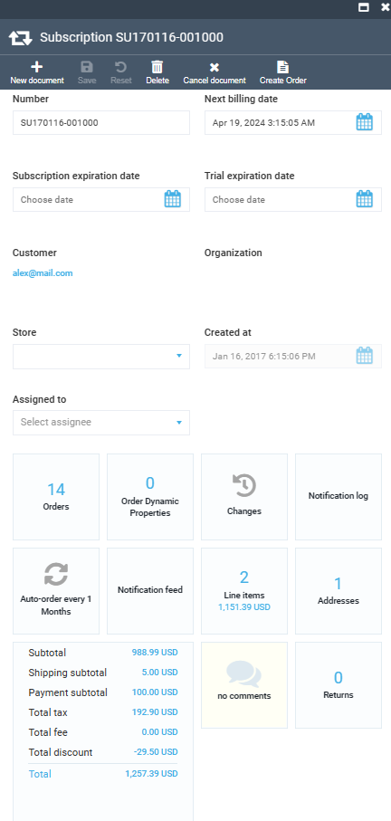
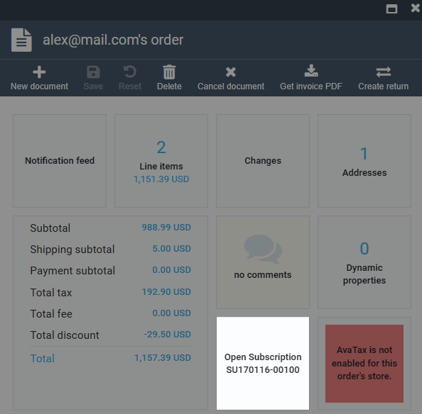

# Overview

The **Subscription** module enables retailers to sell subscription-based offerings and buyers to place recurring orders online. 

When [enabled](enabling-subscriptions.md), the subscriptions will be displayed:

* [In the Subscriptions module.](overview.md#view-subscriptions-in-subscriptions-module)
* [In the Order module.](overview.md#view-subscriptions-in-order-module)

## View subscriptions in Subscriptions module

To view all the created subscriptions, click **Subscriptions** in the main menu. The next blade displays the list of created subscriptions:

{: style="display: block; margin: 0 auto;" }

Click on the required subscription to edit it:

{: style="display: block; margin: 0 auto;" }

## View subscriptions in Order module

To view the created subscriptions by the order for which they were created:

1. Click **Orders** in the main menu.
1. In the next blade, select the required order.
1. In the next blade, the subscriptions widget displays the subscriptions available for this order.

    {: style="display: block; margin: 0 auto;" }

1. Click on the widget to edit the subscription.

 
 
********

    <a href="../../sitemaps/overview">← Sitemaps module overview</a>
    <a href="../enabling-subscriptions">Enabling subscriptions →</a>

